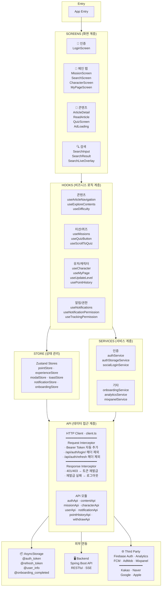
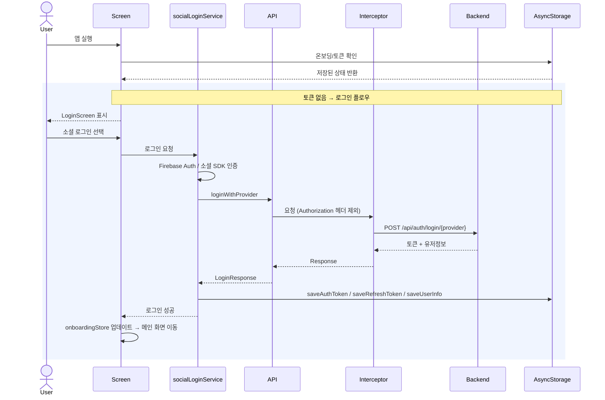
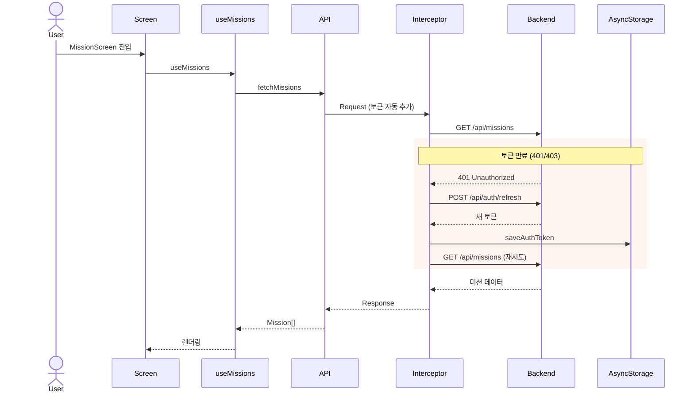
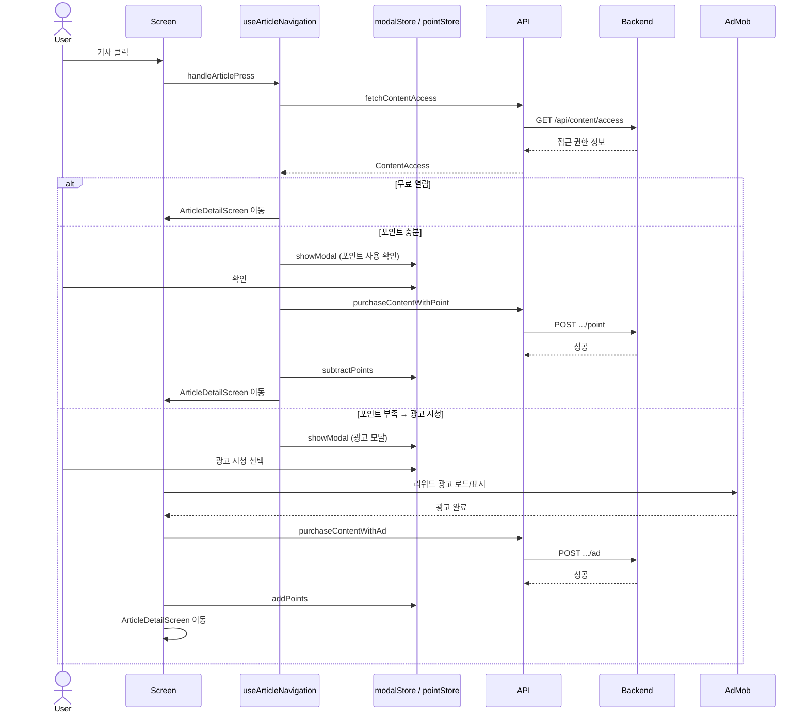
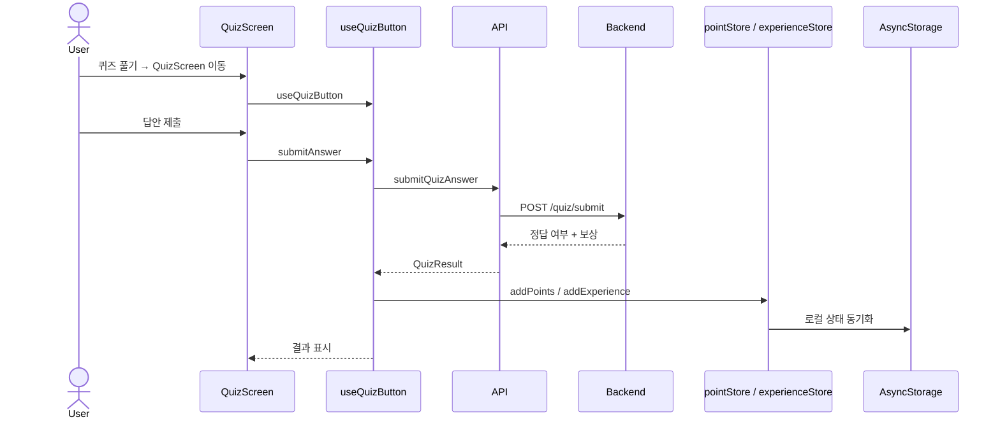
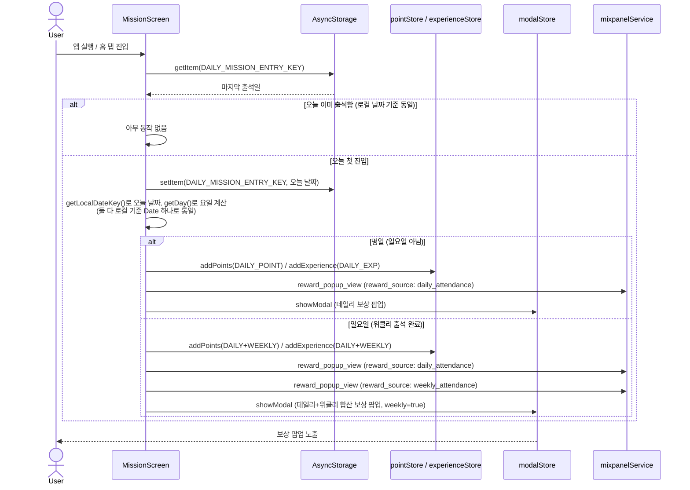
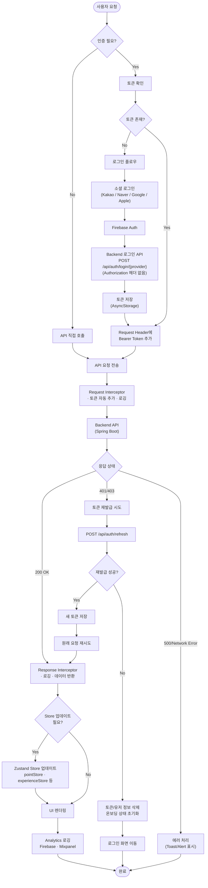

# 아키텍처

## 1. 전체 책임 구조도 (Layered Architecture)

 

## 2. 전체 호출 흐름도 (Sequence Diagram)

### 2-1. 앱 시작 및 인증 플로우

### 2-2. 메인 기능 플로우 (미션 조회 + 토큰 재발급)

### 2-3. 기사 읽기 플로우 (콘텐츠 접근 3분기)

### 2-4. 퀴즈 풀기 플로우

### 2-5. 출석 체크 및 보상 플로우 (데일리 + 위클리 합산)

**설계 메모**

- 위클리 출석은 서버 API 없이 클라이언트에서 요일(일요일)만으로 판단하며, 항상 그날의 데일리 출석과 같은 시점에 합산 지급된다. 별도의 위클리 전용 dedup 키가 없는 이유는 `DAILY_MISSION_ENTRY_KEY`의 하루 1회 체크가 이미 위클리 중복 지급도 막아주기 때문
- 팝업은 하나로 합쳐서 보여주지만(`ExperienceModalContent`의 `weekly` prop), Mixpanel 분석 이벤트는 `daily_attendance` / `weekly_attendance` 두 건으로 나눠서 전송한다 (소스별 집계를 위해)
- 날짜 판단은 반드시 로컬(기기) 기준으로 통일해야 한다. `Date.toISOString()`(UTC)과 `Date.getDay()`(로컬)를 섞어 쓰면 한국시간 자정~오전 9시 사이 요일 판별이 어긋나는 버그가 있었다 (`src/utils/dateUtils.ts`의 `getLocalDateKey()` 참고)

 

## 3. 주요 요청 흐름도 (Request Processing Flow)

 

## 아키텍처 특징 요약

### 계층 분리 (Layered Architecture)

- **Presentation**: React Native 화면 컴포넌트
- **Business Logic**: Custom Hooks로 비즈니스 로직 분리
- **State Management**: Zustand를 통한 전역 상태 관리
- **Service**: 인증, 소셜로그인, 분석 등 도메인 서비스
- **Data Access**: Axios 기반 API 클라이언트

### 주요 패턴

- **Interceptor 패턴**: 요청/응답 자동 처리 (토큰, 로깅, 재발급)
- **Custom Hooks**: 재사용 가능한 비즈니스 로직 캡슐화
- **Store Pattern**: Zustand로 전역 상태 관리
- **API Module Pattern**: 도메인별 API 모듈로 데이터 접근 로직 분리
- **Service/API Layer 분리**: 인증·소셜로그인·분석 로직과 HTTP 요청 모듈을 역할별로 분리

### 데이터 흐름

- **요청**: Screen → Hook → API → Interceptor → Backend
- **응답**: Backend → Interceptor → API → Hook → Store → Screen
- **에러**: Interceptor에서 자동 재시도/로그아웃 처리
