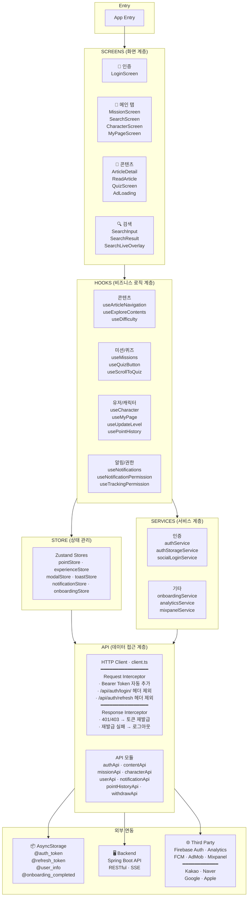
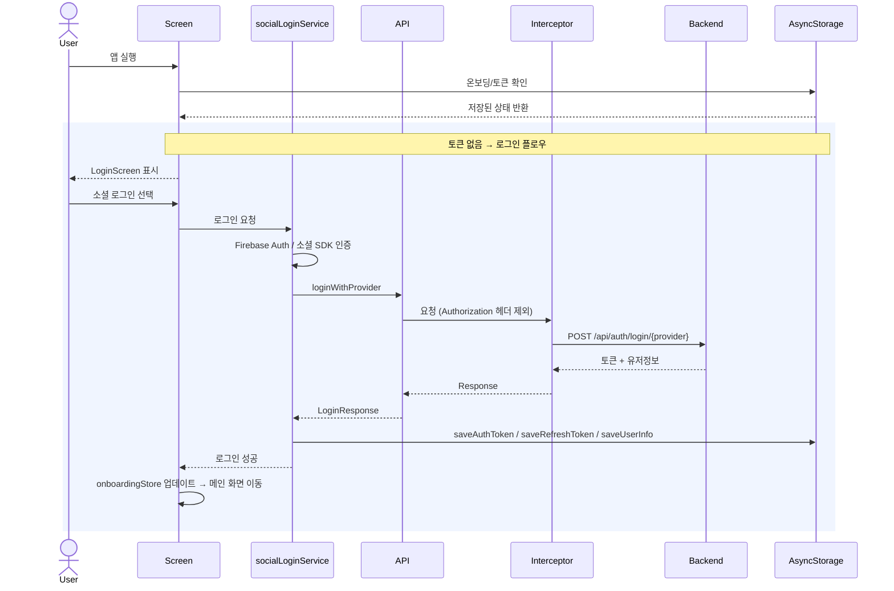
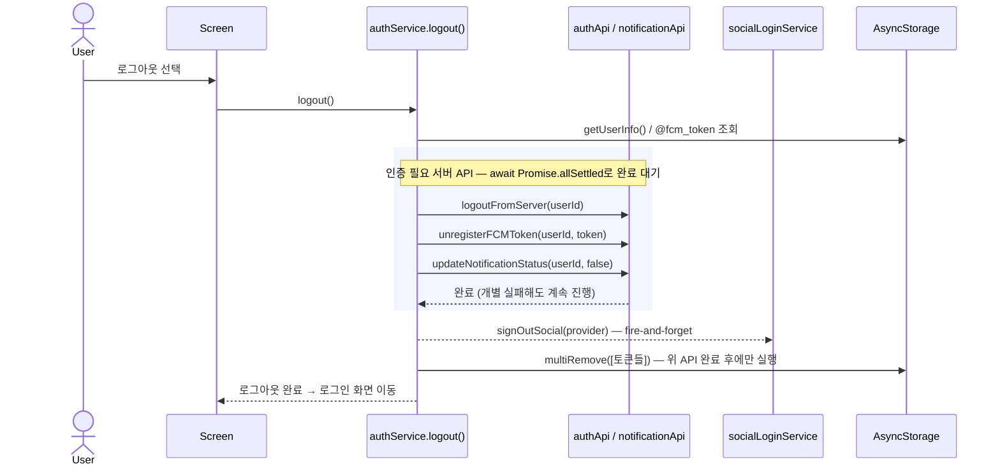
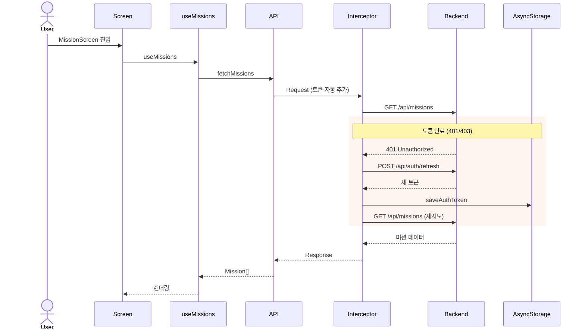
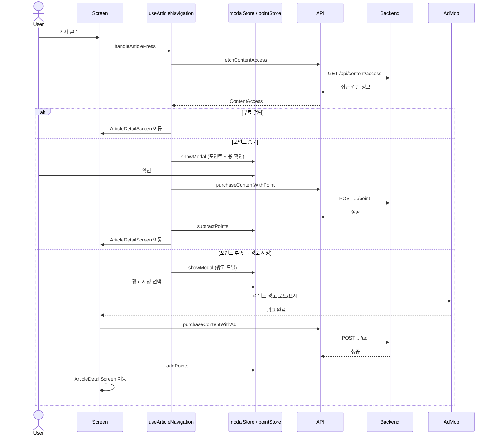
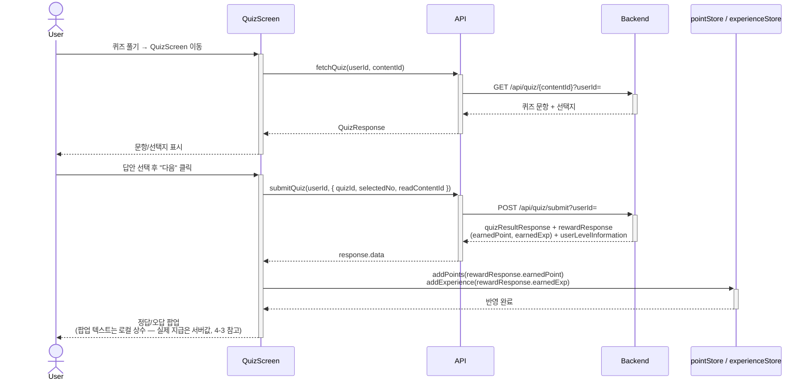
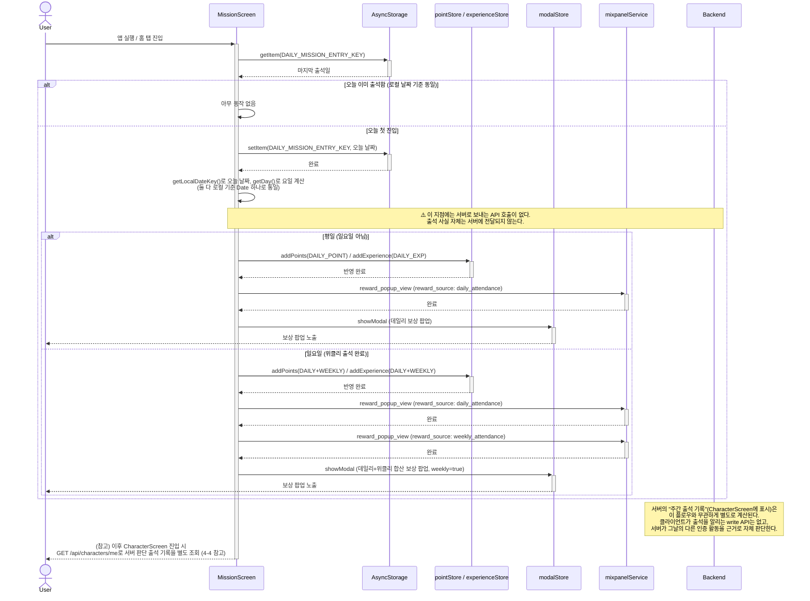
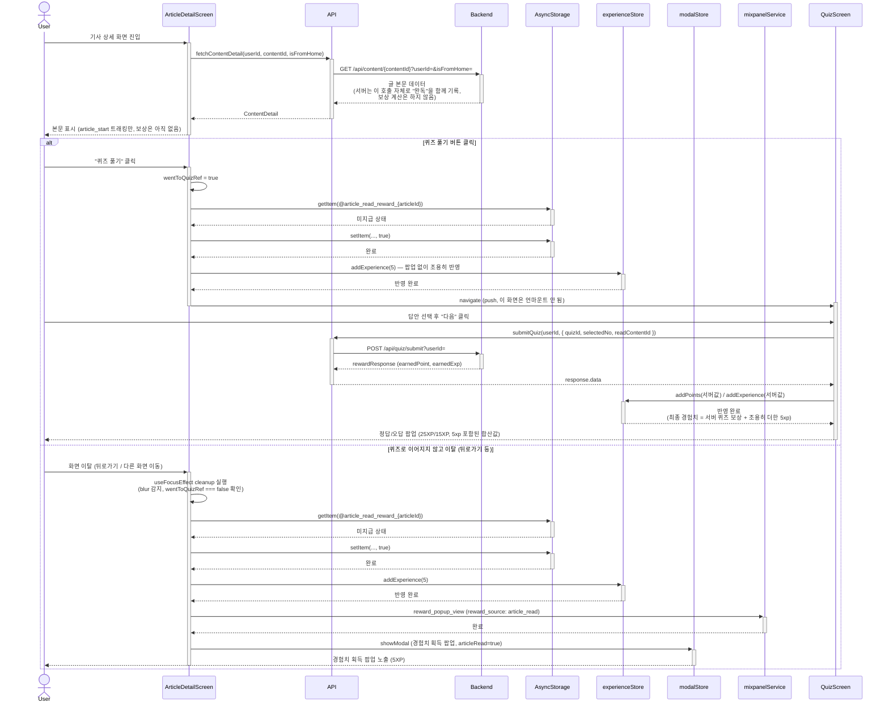
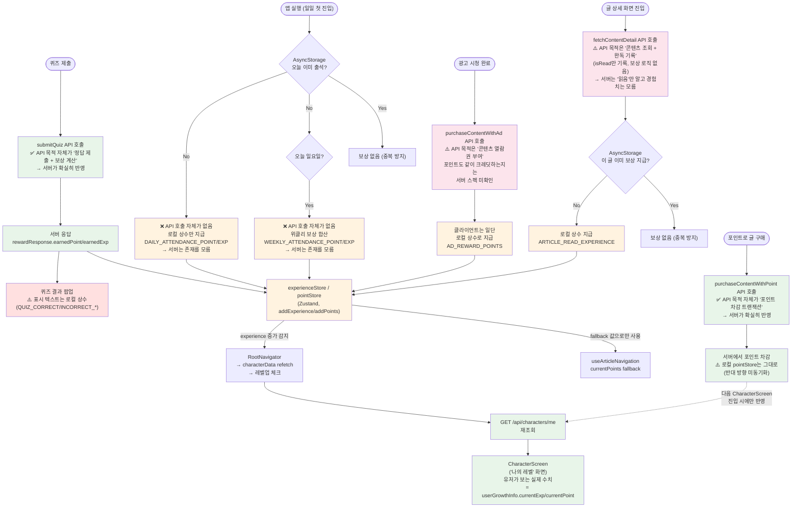
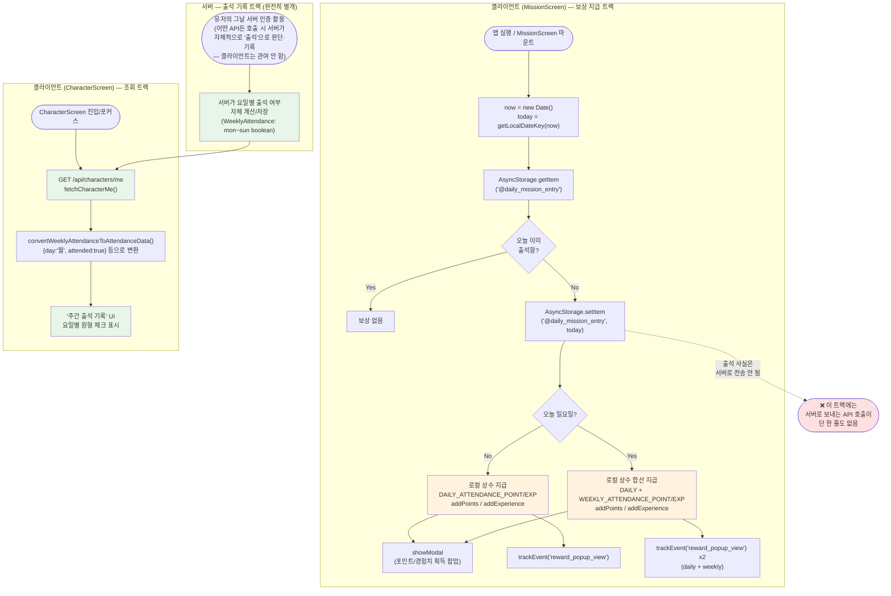

# 아키텍처

## 1. 전체 책임 구조도 (Layered Architecture)

 

## 2. 전체 호출 흐름도 (Sequence Diagram)

### 2-1. 앱 시작 및 인증 플로우

#### 로그아웃 플로우 (참고)

> ⚠️ **순서 주의**: 인증 필요 API(위 rect 영역)를 로컬 토큰 삭제보다 먼저 완료해야 함. 순서가 뒤바뀌면 요청 인터셉터가 토큰을 헤더에 붙이기 전에 토큰이 삭제되어 401이 발생함 (`docs/AUTH_FLOW.md`의 "로그아웃 순서 보장", `docs/TROUBLESHOOTING.md`의 "네이버/구글 로그아웃·탈퇴 시 401" 참고).

### 2-2. 메인 기능 플로우 (미션 조회 + 토큰 재발급)

### 2-3. 기사 읽기 플로우 (콘텐츠 접근 3분기)

### 2-4. 퀴즈 풀기 플로우

### 2-5. 출석 체크 및 보상 플로우 (데일리 + 위클리 합산)

**설계 메모**

- 위클리 출석은 서버 API 없이 클라이언트에서 요일(일요일)만으로 판단하며, 항상 그날의 데일리 출석과 같은 시점에 합산 지급된다. 별도의 위클리 전용 dedup 키가 없는 이유는 `DAILY_MISSION_ENTRY_KEY`의 하루 1회 체크가 이미 위클리 중복 지급도 막아주기 때문
- 팝업은 하나로 합쳐서 보여주지만(`ExperienceModalContent`의 `weekly` prop), Mixpanel 분석 이벤트는 `daily_attendance` / `weekly_attendance` 두 건으로 나눠서 전송한다 (소스별 집계를 위해)
- 날짜 판단은 반드시 로컬(기기) 기준으로 통일해야 한다. `Date.toISOString()`(UTC)과 `Date.getDay()`(로컬)를 섞어 쓰면 한국시간 자정~오전 9시 사이 요일 판별이 어긋나는 버그가 있었다 (`src/utils/dateUtils.ts`의 `getLocalDateKey()` 참고)
- 이 플로우 전체에 백엔드 호출이 없다는 것 자체가 중요한 특징이다. 서버가 보여주는 "주간 출석 기록"은 이 로컬 보상 지급과 완전히 별개의 시스템이며, 서버에 출석을 기록시키는 write API는 코드 전체에 존재하지 않는다 (4-4 참고)

### 2-6. 글 읽기 보상 플로우 (퀴즈 이어풀기 시 합산)

**설계 메모**

- React Navigation 스택 구조상 퀴즈로 `push`해도 `ArticleDetailScreen`은 언마운트되지 않고 blur만 되므로, 일반 `useEffect`의 unmount cleanup이 아니라 `useFocusEffect`의 cleanup으로 이탈을 감지한다. 뒤로가기(pop)와 퀴즈 이동(push) 둘 다 blur를 거치므로 한 cleanup으로 두 경우를 모두 처리할 수 있다.
- `wentToQuizRef`로 두 경로를 나눈다: 퀴즈로 이동한 경우는 팝업 없이 store에만 조용히 반영하고(퀴즈 결과 팝업이 합산값을 보여주므로), 이어지지 않은 이탈은 자체 팝업으로 5xp를 보여준다.
- 이 플로우에는 백엔드 호출이 두 곳 있다: 화면 진입 시 `fetchContentDetail`(완독 기록은 겸하지만 보상 계산은 하지 않음)과, 퀴즈 경로에서만 발생하는 `submitQuiz`(실제 보상값을 서버가 계산). 글 읽기 5xp 자체는 두 호출 중 어디에도 실려가지 않고 클라이언트에서만 계산된다.
- dedup 키(`@article_read_reward_{articleId}`)는 두 경로가 공유한다 — 글 하나당 평생 한 번만 지급.
- 퀴즈 경로의 최종 지급액(서버값 + 로컬 5xp)과 QuizScreen 팝업에 표시되는 고정 텍스트(25XP/15XP)는 별개의 값이다. 팝업 텍스트는 `QUIZ_CORRECT_EXPERIENCE` 같은 로컬 상수를 그대로 보여줄 뿐, 실제 서버 보상액과 정확히 일치한다는 보장은 없다 (4-3 참고). 서버가 정답 보상으로 정확히 20xp를 주는지 등은 백엔드 확인이 필요하다.

 

## 3. 주요 요청 흐름도 (Request Processing Flow)

 

## 4. 보상(Reward) 시스템 — 서버 값 vs 로컬 값

포인트/경험치가 여러 화면(퀴즈, 출석, 광고, 글 읽기)에서 지급되면서 "이 숫자가 서버에서 온 건지 프론트에서 만든 건지" 헷갈리기 쉬워서 별도로 정리한다.

### 4-1. 보상 트리거 → 지급 → 화면 반영 전체 흐름도

6가지 보상 트리거가 각각 서버값을 쓰는지 로컬 상수를 쓰는지, 그리고 그 값이 어디로 흘러가는지를 하나의 흐름도로 정리한다.

🟢 초록(서버 값) · 🟠 주황(로컬 상수, 서버 미반영) · 🔴 빨강(표시값과 실제 지급값이 다를 수 있는 지점)

**읽는 법**: 왼쪽의 6개 시작점(퀴즈 제출/일일 출석/광고 시청/글 진입/포인트 구매)이 각각 어떤 방식으로 보상을 만들어내는지 보여준다. 서버 API를 호출해도 그 응답값을 실제로 쓰는 건 퀴즈뿐이고, 나머지는 API를 호출하더라도(광고, 포인트 구매) 보상액 자체는 로컬 상수이거나 서버 차감이 로컬에 반영되지 않는다. 결국 모든 로컬 지급은 `LocalStore`로 모이지만, 유저가 실제로 보는 `CharacterScreen`은 이 store를 거치지 않고 서버를 직접 재조회한 값만 보여준다 — 그래서 로컬 지급은 "유저 체감상 즉시 받은 것처럼 보이지만, 서버 기준 실제 수치와는 별개"라는 점이 이 흐름도의 핵심이다.

### 4-2. 보상 종류별 지급 방식 (요약 표)

| 보상 | 실제 지급값 출처 | 지급 방식 | 관련 파일 |
| --- | --- | --- | --- |
| 퀴즈 정답/오답 | **서버** — `submitQuiz` 응답의 `rewardResponse.earnedPoint`/`earnedExp` | `addPoints(서버값)` / `addExperience(서버값)` | `QuizScreen.tsx` |
| 퀴즈 팝업에 **표시되는 텍스트** | ⚠️ 로컬 고정값 (`QUIZ_CORRECT_EXPERIENCE` 등) — 실제 지급된 서버값과 다를 수 있음 | `ExperienceModalContent`가 상수를 그대로 렌더링 | `ArticlePointModalContent.tsx` |
| 데일리 출석 | 로컬 상수 (`DAILY_ATTENDANCE_POINT`/`EXPERIENCE`) — 서버 API 호출 없음 | AsyncStorage로 하루 1회 dedup 후 로컬 지급 | `MissionScreen.tsx` |
| 위클리 출석 | 로컬 상수 (`WEEKLY_ATTENDANCE_POINT`/`EXPERIENCE`) — 서버 API 호출 없음 | 일요일 데일리 출석과 같은 시점에 합산 지급 | `MissionScreen.tsx` |
| 광고 시청 | 로컬 상수 (`AD_REWARD_POINTS`) — `purchaseContentWithAd` API는 별도 호출되지만 지급액은 로컬 상수 | 광고 시청 완료 시 로컬 지급 | `AdLoadingScreen.tsx` |
| 글 읽기 | 로컬 상수 (`ARTICLE_READ_EXPERIENCE`) — 서버 API 호출 없음 (완독 처리는 `fetchContentDetail` 호출 자체가 겸함) | AsyncStorage로 글 ID당 1회 dedup 후 로컬 지급 | `ArticleDetailScreen.tsx` |
| 포인트로 글 열람 (비용 차감) | ⚠️ 서버만 차감 — `purchaseContentWithPoint` 성공해도 로컬 `pointStore`는 차감되지 않음 (미동기화) | - | `useArticleNavigation.ts` |

### 4-3. 알아둘 점

- **로컬 지급(출석/광고/글 읽기)은 서버가 실제로 아는 값이 아니다.** 클라이언트가 "이만큼 준 걸로 치자"하고 흉내 내는 것에 가깝다. 유저가 캐릭터 탭에서 실제 경험치/포인트를 확인하면 서버가 카운트한 적 없는 값이라 반영되지 않을 수 있다.
- **정확한 지급을 보장하려면 서버 API가 필요하다.** 현재는 퀴즈만 서버 왕복으로 정확한 값을 받고, 나머지는 전부 프론트 추정치다.
- **퀴즈 팝업 표시값과 실제 지급값이 다를 수 있다.** 팝업은 `QUIZ_CORRECT_EXPERIENCE`(25) 같은 로컬 상수를 그대로 보여주지만, 실제로 store에 더해지는 값은 서버가 응답한 `rewardResponse.earnedExp`다. 서버 리워드 정책이 바뀌면 팝업 표시값도 함께 업데이트해야 한다.
- **포인트 구매(글 열람) 차감이 로컬에 반영되지 않는다.** 서버는 포인트를 차감하지만 `pointStore`는 그대로라, 다음 서버 재조회 전까지 로컬 fallback 값이 실제보다 높게 남아있을 수 있다.

### 4-4. 출석 보상 지급 vs 서버 출석 기록 조회 — 서로 무관한 두 트랙

**데일리/위클리 출석 "보상 지급"과, CharacterScreen에 보이는 "주간 출석 기록(요일별 체크)"은 완전히 다른 시스템이다.** 하나는 순수 로컬, 하나는 서버 조회이며 둘은 서로 데이터를 주고받지 않는다.

- **보상 지급 트랙 (`MissionScreen.tsx`)**: `AsyncStorage` 키 `@daily_mission_entry`로 "오늘 이미 출석했는가"만 로컬 체크하고, 통과하면 로컬 상수를 `addPoints`/`addExperience`로 바로 반영한다. 서버에 "오늘 출석했다"를 알리는 API 호출은 코드 전체에 존재하지 않는다 (`client.post`/`patch` + attendance/출석 키워드로 전수 검색해도 0건).
- **출석 기록 조회 트랙 (`CharacterScreen.tsx`)**: 요일별 체크 원(`주간 출석 기록`)은 `GET /api/characters/me` (`fetchCharacterMe`, `src/api/characterApi.ts:384-399`)의 응답 중 `attendance` 필드(`WeeklyAttendance`: `monday~sunday` boolean, `characterApi.ts:118-126`)를 그대로 그려주는 것이다. 이 값은 서버가 자체적으로 계산해서 내려주며, 클라이언트가 별도로 "기록"시키는 write API는 존재하지 않는다.
- **서버가 정확히 무엇을 근거로 출석을 판단하는지는 코드로 확인 불가.** 그날 다른 API를 하나라도 호출하면 출석 처리되는 것인지, 별도 로그인/세션 체크인지는 백엔드 스펙 확인이 필요하다.
- **결론**: 유저가 실제로 받는 포인트/경험치(로컬)와 CharacterScreen에 보이는 "출석 기록"(서버)은 서로 다른 기준으로 독립적으로 움직인다. 둘을 같은 하나의 "출석 시스템"으로 오해하지 않도록 주의.

 

## 아키텍처 특징 요약

### 계층 분리 (Layered Architecture)

- **Presentation**: React Native 화면 컴포넌트
- **Business Logic**: Custom Hooks로 비즈니스 로직 분리
- **State Management**: Zustand를 통한 전역 상태 관리
- **Service**: 인증, 소셜로그인, 분석 등 도메인 서비스
- **Data Access**: Axios 기반 API 클라이언트

### 주요 패턴

- **Interceptor 패턴**: 요청/응답 자동 처리 (토큰, 로깅, 재발급)
- **Custom Hooks**: 재사용 가능한 비즈니스 로직 캡슐화
- **Store Pattern**: Zustand로 전역 상태 관리
- **API Module Pattern**: 도메인별 API 모듈로 데이터 접근 로직 분리
- **Service/API Layer 분리**: 인증·소셜로그인·분석 로직과 HTTP 요청 모듈을 역할별로 분리

### 데이터 흐름

- **요청**: Screen → Hook → API → Interceptor → Backend
- **응답**: Backend → Interceptor → API → Hook → Store → Screen
- **에러**: Interceptor에서 자동 재시도/로그아웃 처리

### 내부 테스트 전용 화면 (스토어 스크린샷용)

`MockArticleDetailScreen.tsx` / `MockQuizScreen.tsx`(`src/screens/common/`)는 스토어 등록용 스크린샷 촬영을 위해 추가된 화면이다.

- `ArticleDetailScreen` / `QuizScreen`과 시각적으로 동일하지만, 서버 API 호출과 포인트·경험치 지급 로직이 없다. 콘텐츠는 `src/data/mock/mockArticleQuiz.ts`에 고정된 값을 사용한다.
- (2026-08-09 기준) 홈(`MissionScreen`)·탐색(`SearchScreen`) 리스트 맨 위 mock 카드 노출은 비활성화되어 현재 진입 경로가 없다. 라우트(`MOCK_ARTICLE_DETAIL` / `MOCK_QUIZ`)와 화면·데이터 파일은 재사용을 위해 그대로 유지된다.
- 실제 `ArticleDetailScreen` / `QuizScreen`의 로직에는 영향을 주지 않는 별도 화면이다.
