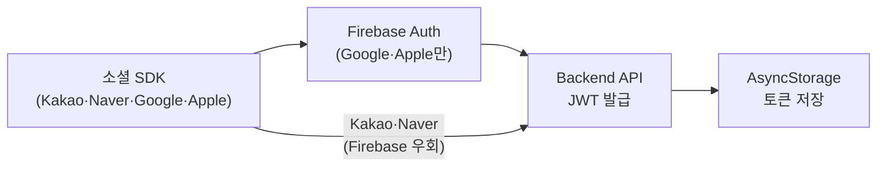

# 인증 플로우

## 개요

뉴로스는 4종 소셜 로그인(Kakao / Naver / Google / Apple)을 지원하며, Firebase Auth를 거쳐 자체 Backend에서 JWT를 발급받는 구조입니다.



<br />

## 소셜 로그인 통합 아키텍처

### 제공자별 인증 방식

| 제공자 | 경로 | Firebase Auth 사용 |
| --- | --- | --- |
| **Google** | Google Sign-In SDK → Firebase Auth → Backend | ✅ |
| **Apple** | Apple Authentication → Firebase Auth → Backend | ✅ |
| **Kakao** | Kakao SDK → Backend 직접 | ❌ (우회) |
| **Naver** | Naver SDK → Backend 직접 | ❌ (우회) |

### SocialLoginResult 공통 인터페이스

제공자별 SDK 응답 형태가 달라 화면에서 분기가 복잡해지는 문제를, `SocialLoginResult` 인터페이스로 추상화하고 `socialLoginService` 단일 모듈로 통합했습니다.

```
LoginScreen → socialLoginService.login(provider)
                    ↓
              SocialLoginResult { token, provider, ... }
                    ↓
              authApi.loginWithProvider(result)
                    ↓
              AsyncStorage 토큰 저장
```

### 주요 파일

- `services/socialLoginService.ts` — 제공자별 SDK 호출 통합, 공통 인터페이스 반환
- `services/authService.ts` — 로그인/로그아웃 오케스트레이션
- `services/authStorageService.ts` — AsyncStorage 토큰 CRUD
- `api/authApi.ts` — Backend 인증 API 호출

<br />

## Firebase Auth 연동

Google/Apple 로그인은 Firebase Auth를 거쳐 nonce 검증 및 토큰 표준화를 처리합니다.

- Google: 직접 구현한 `@react-native-google-signin/google-signin` 기반 로그인 흐름에서 Firebase credential 생성
- Apple: 팀원이 구현한 `@invertase/react-native-apple-authentication` SDK 연동을 공통 `SocialLoginResult` 구조에 통합

Kakao/Naver는 Firebase Auth를 거치지 않고 소셜 SDK에서 받은 토큰을 Backend에 직접 전달합니다.

<br />

## JWT 토큰 관리

### 저장 구조 (AsyncStorage)

| 키 | 값 |
| --- | --- |
| `@auth_token` | Access Token (JWT) |
| `@refresh_token` | Refresh Token |
| `@user_info` | 유저 정보 JSON |

### 토큰 생명주기

1. **발급**: `POST /api/auth/login/{provider}` 응답에서 access + refresh 토큰 수신
2. **저장**: `authStorageService`가 AsyncStorage에 영구 저장
3. **사용**: Axios 인터셉터가 매 요청 헤더에 자동 첨부
4. **갱신**: 401/403 응답 시 인터셉터가 `POST /api/auth/refresh`로 자동 재발급 (동시에 여러 요청이 401을 받아도 재발급은 1회만 실행 — 아래 "동시 401 처리" 참고)
5. **삭제**: 로그아웃 또는 재발급 실패 시 `AsyncStorage.multiRemove`

<br />

## Axios Interceptor (client.ts)

### Request Interceptor

- 모든 요청에 `Authorization: Bearer <token>` 헤더 자동 추가
- **예외 경로** (헤더 제외):
  - `/api/auth/login/` — 소셜 로그인 공개 API
  - `/api/auth/refresh` — 토큰 재발급 API
- 요청 로깅 (개발 모드)

### Response Interceptor

- 401/403 감지 → `POST /api/auth/refresh`로 재발급 시도
- 재발급 성공 → 새 토큰 저장 + 원래 요청 자동 재시도
- 재발급 실패 → 토큰/유저 정보 삭제 → 온보딩 상태 초기화 → 로그인 화면 이동
- 무한 재시도 방지: 요청별 `_retry` 플래그로 이미 재시도한 요청은 다시 재발급을 트리거하지 않음
- 재발급 API(`/api/auth/refresh`) 자체가 401/403이면 큐 로직을 거치지 않고 바로 `clearAuthAndRedirect()`로 직행 (재발급의 재발급을 시도하지 않음)

### 동시 401 처리 (Refresh 큐)

여러 요청이 동시에 401을 받으면 재발급 API가 중복 호출될 수 있습니다 (예: 화면 진입 시 여러 API를 병렬로 호출하는 경우). 이를 막기 위해 `client.ts`에 모듈 레벨 상태로 `isRefreshing` 플래그와 `refreshSubscribers` 대기열을 둡니다 (`src/api/client.ts:48-67, 209-296`).

- 첫 번째 401: `isRefreshing = true`로 세팅하고 재발급 API를 호출. 재발급이 끝날 때까지 다른 401 요청들은 실제 재발급을 트리거하지 않는다.
- 재발급 진행 중 도착한 나머지 401 요청들: 즉시 재발급을 시도하지 않고 `refreshSubscribers` 배열에 `{ resolve, reject }`로 쌓여서 대기한다.
- 재발급 성공: `onRefreshSuccess(newAccessToken)`이 대기 중이던 모든 subscriber를 새 토큰으로 `resolve` → 각 원래 요청이 새 토큰을 헤더에 넣고 자동 재시도된다.
- 재발급 실패: `onRefreshFailure`가 대기 중이던 모든 subscriber를 `reject` → 각 요청이 그대로 실패 처리된다.

즉 재발급 API 호출은 항상 1회로 수렴하고, 그 결과를 기다리던 모든 요청이 한꺼번에 재개되거나 한꺼번에 실패하는 구조입니다.

### 네트워크 에러 재시도

401/403과 별개로, 서버 응답 자체를 받지 못한 경우(타임아웃, 연결 끊김 등 `error.response`가 없는 경우)에는 최대 2회까지 선형 백오프로 재시도합니다 (`src/api/client.ts:144-154, 188-206`).

- `MAX_NETWORK_RETRY = 2`
- 재시도 간격: `500ms × (재시도 횟수 + 1)` → 1차 500ms, 2차 1000ms
- 4xx/5xx처럼 서버가 실제로 응답한 에러에는 적용되지 않음 (응답이 아예 없는 경우만 대상)

### 인터셉터 헤더 제외가 필요한 이유

탈퇴 후 다른 계정으로 로그인하는 시나리오에서, `withdraw()` 흐름 중 서버 API 실패 시 `AsyncStorage.multiRemove`에 도달하지 못해 이전 계정의 stale 토큰이 잔류할 수 있습니다. 이 토큰이 소셜 로그인 API 요청에 딸려가면 서버가 탈퇴된 계정을 검증하려다 500을 반환합니다. `/api/auth/login/` 경로를 헤더 제외 대상에 추가해 해결했습니다. (`/api/auth/refresh`, `/api/auth/login/` 두 경로만 제외 대상이며 그 외 경로는 모두 헤더가 자동 첨부됩니다 — `src/api/client.ts:101-115`)

<br />

## TanStack Query 재시도 정책 (queryClient.ts)

Axios 인터셉터가 이미 401/403에 대한 재발급·재시도를 전담하기 때문에, TanStack Query 레벨에서 같은 요청을 또 재시도하면 재발급 로직과 중복/경합할 수 있습니다. 그래서 `src/config/queryClient.ts:13-24`에서 401/403은 Query의 재시도 대상에서 명시적으로 제외합니다.

```ts
retry: (failureCount, error) => {
  const status = error?.response?.status;
  if (status === 401 || status === 403) {
    return false; // Axios 인터셉터가 이미 처리하므로 Query는 재시도하지 않음
  }
  return failureCount < 1;
},
retryDelay: attemptIndex => Math.min(1000 * 2 ** attemptIndex, 30000),
```

- Query(조회)는 401/403 제외 시 최대 1회 재시도
- Mutation(변경)은 `retry: 0` — 실패 시 재시도 없음

<br />

## 로그인/로그아웃 성능 최적화 (Fire-and-forget)

로그인/로그아웃 체감 속도를 높이기 위해, 응답을 기다릴 필요가 없는 부가 작업들은 `await` 없이 백그라운드로 흘려보내고 있습니다. 화면 전환이나 로컬 상태 정리는 이 작업들의 완료를 기다리지 않습니다.

- **로그아웃** (`src/services/authService.ts:233-288`): 서버 로그아웃 API, FCM 토큰 해제, 알림 상태 초기화, 소셜 SDK sign-out을 `tasks` 배열에 담아 `Promise.allSettled(tasks)`를 **await 없이** 실행한 뒤, 곧바로 `AsyncStorage.multiRemove(...)`와 `resetUser()`를 진행합니다. 즉 로컬 로그아웃 처리(토큰 삭제, 화면 전환)는 서버 응답을 기다리지 않고 즉시 이루어집니다. `withdraw()`(회원 탈퇴)에서도 `withdrawUser` 호출 자체는 await하지만, 그 이후의 `signOutSocial`/`unregisterFCMToken`은 동일하게 fire-and-forget입니다 (`authService.ts:388-399`).
- **로그인 후 부가 작업**: `saveAuthData`에서 Mixpanel `identifyUser(...)` 호출이 `.catch()`만 붙은 채 await 없이 실행됩니다 (`authService.ts:168-173`). `socialLoginService.ts`의 각 제공자별 로그인 흐름에서도 FCM 토큰 등록(`messaging().getToken().then(...).catch(...)`)이 await 없이 실행되어, 로그인 자체는 FCM 등록 완료를 기다리지 않고 반환됩니다 (예: `socialLoginService.ts:126-132, 276-283, 442-449, 602-609`).

**주의**: 이 부가 작업들이 실패해도 로그인/로그아웃 자체의 성공 여부에는 영향을 주지 않습니다. 대신 실패는 `.catch()`로 로깅만 되고 사용자에게 노출되지 않으므로, FCM 미등록이나 Mixpanel 미식별 같은 문제는 별도 모니터링이 없으면 알아차리기 어렵습니다.

<br />

## 약관 동의 플로우

소셜 로그인 실행 전에 약관 동의 화면을 별도 플로우로 분리했습니다. 동의 완료 후 선택한 제공자 정보를 파라미터로 전달하여 로그인을 재개하는 구조입니다.

```
LoginScreen → TermsAgreementScreen → (동의 완료) → LoginScreen으로 복귀 + 로그인 재개
```
