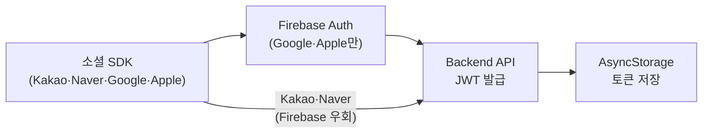

# 인증 플로우

## 개요

뉴로스는 4종 소셜 로그인(Kakao / Naver / Google / Apple)을 지원하며, Firebase Auth를 거쳐 자체 Backend에서 JWT를 발급받는 구조입니다.



<br />

## 소셜 로그인 통합 아키텍처

### 제공자별 인증 방식

| 제공자 | 경로 | Firebase Auth 사용 |
| --- | --- | --- |
| **Google** | Google Sign-In SDK → Firebase Auth → Backend | ✅ |
| **Apple** | Apple Authentication → Firebase Auth → Backend | ✅ |
| **Kakao** | Kakao SDK → Backend 직접 | ❌ (우회) |
| **Naver** | Naver SDK → Backend 직접 | ❌ (우회) |

### SocialLoginResult 공통 인터페이스

제공자별 SDK 응답 형태가 달라 화면에서 분기가 복잡해지는 문제를, `SocialLoginResult` 인터페이스로 추상화하고 `socialLoginService` 단일 모듈로 통합했습니다.

```
LoginScreen → socialLoginService.login(provider)
                    ↓
              SocialLoginResult { token, provider, ... }
                    ↓
              authApi.loginWithProvider(result)
                    ↓
              AsyncStorage 토큰 저장
```

### 주요 파일

- `services/socialLoginService.ts` — 제공자별 SDK 호출 통합, 공통 인터페이스 반환
- `services/authService.ts` — 로그인/로그아웃 오케스트레이션
- `services/authStorageService.ts` — AsyncStorage 토큰 CRUD
- `api/authApi.ts` — Backend 인증 API 호출

<br />

## Firebase Auth 연동

Google/Apple 로그인은 Firebase Auth를 거쳐 nonce 검증 및 토큰 표준화를 처리합니다.

- Google: 직접 구현한 `@react-native-google-signin/google-signin` 기반 로그인 흐름에서 Firebase credential 생성
- Apple: 팀원이 구현한 `@invertase/react-native-apple-authentication` SDK 연동을 공통 `SocialLoginResult` 구조에 통합

Kakao/Naver는 Firebase Auth를 거치지 않고 소셜 SDK에서 받은 토큰을 Backend에 직접 전달합니다.

<br />

## JWT 토큰 관리

### 저장 구조 (AsyncStorage)

| 키 | 값 |
| --- | --- |
| `@auth_token` | Access Token (JWT) |
| `@refresh_token` | Refresh Token |
| `@user_info` | 유저 정보 JSON |

### 토큰 생명주기

1. **발급**: `POST /api/auth/login/{provider}` 응답에서 access + refresh 토큰 수신
2. **저장**: `authStorageService`가 AsyncStorage에 영구 저장
3. **사용**: Axios 인터셉터가 매 요청 헤더에 자동 첨부
4. **갱신**: 401/403 응답 시 인터셉터가 `POST /api/auth/refresh`로 자동 재발급
5. **삭제**: 로그아웃 또는 재발급 실패 시 `AsyncStorage.multiRemove`

<br />

## Axios Interceptor (client.ts)

### Request Interceptor

- 모든 요청에 `Authorization: Bearer <token>` 헤더 자동 추가
- **예외 경로** (헤더 제외):
  - `/api/auth/login/` — 소셜 로그인 공개 API
  - `/api/auth/refresh` — 토큰 재발급 API
- 요청 로깅 (개발 모드)

### Response Interceptor

- 401/403 감지 → `POST /api/auth/refresh`로 재발급 시도
- 재발급 성공 → 새 토큰 저장 + 원래 요청 자동 재시도
- 재발급 실패 → 토큰/유저 정보 삭제 → 온보딩 상태 초기화 → 로그인 화면 이동

### 인터셉터 헤더 제외가 필요한 이유

탈퇴 후 다른 계정으로 로그인하는 시나리오에서, `withdraw()` 흐름 중 서버 API 실패 시 `AsyncStorage.multiRemove`에 도달하지 못해 이전 계정의 stale 토큰이 잔류할 수 있습니다. 이 토큰이 소셜 로그인 API 요청에 딸려가면 서버가 탈퇴된 계정을 검증하려다 500을 반환합니다. `/api/auth/login/` 경로를 헤더 제외 대상에 추가해 해결했습니다.

<br />

## 약관 동의 플로우

소셜 로그인 실행 전에 약관 동의 화면을 별도 플로우로 분리했습니다. 동의 완료 후 선택한 제공자 정보를 파라미터로 전달하여 로그인을 재개하는 구조입니다.

```
LoginScreen → TermsAgreementScreen → (동의 완료) → LoginScreen으로 복귀 + 로그인 재개
```
