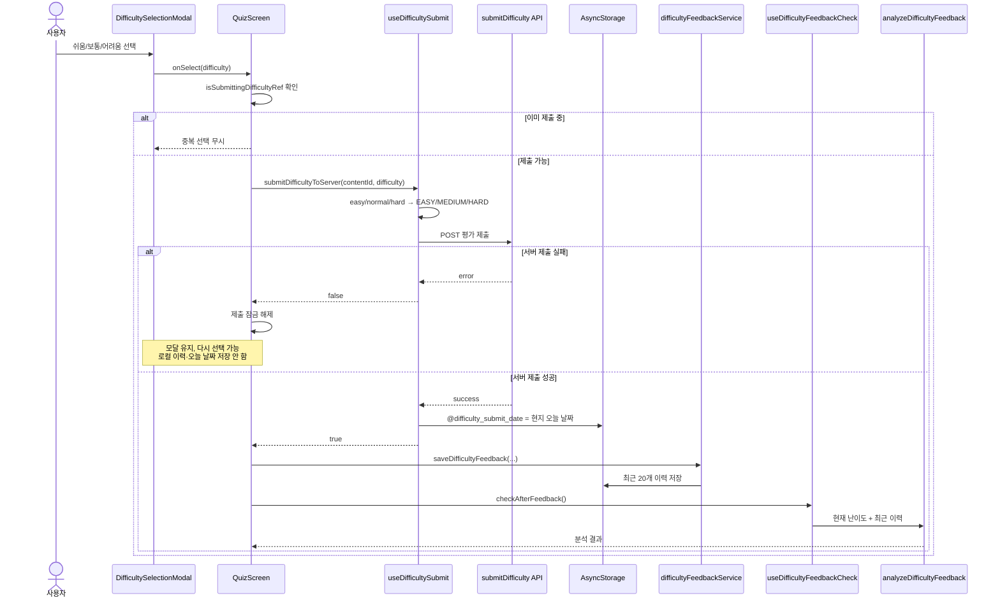
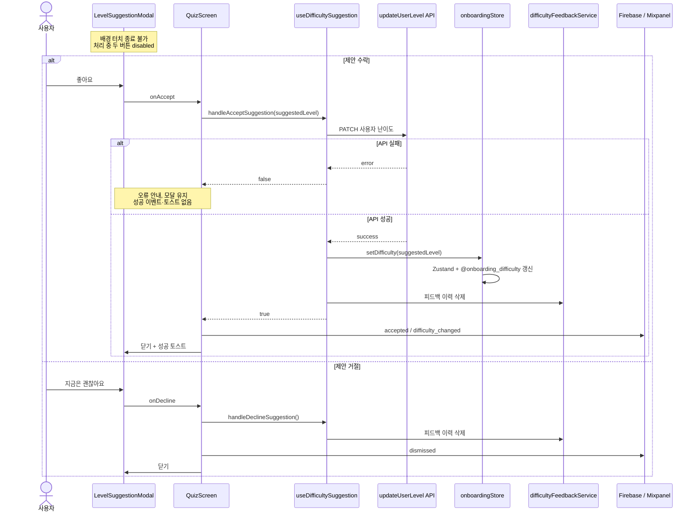

# 난이도 평가 및 변경 제안 플로우

> 최종 갱신: 2026-08-31. 콘텐츠 난이도 평가, 누적 분석, 난이도 변경 제안, 계정 전환 시 초기화까지 현재 클라이언트 구현을 기준으로 정리합니다.

## 1. 용어 구분

이 문서의 "난이도"는 사용자가 읽을 콘텐츠의 수준(`BEGINNER`/`INTERMEDIATE`/`ADVANCED`)입니다. 경험치로 성장하는 캐릭터 레벨(`LEVEL_1`~`LEVEL_5`)과는 다른 시스템입니다.

| 개념 | 값 | 용도 |
| --- | --- | --- |
| 사용자 콘텐츠 난이도 | `BEGINNER`, `INTERMEDIATE`, `ADVANCED` | 추천 콘텐츠 수준과 난이도 변경 제안 기준 |
| 글 체감 평가(UI) | `easy`, `normal`, `hard` | "이번 글이 쉬움/보통/어려움" 평가 |
| 글 체감 평가(API) | `EASY`, `MEDIUM`, `HARD` | 서버의 콘텐츠 난이도 평가 저장 형식 |
| 캐릭터 성장 레벨 | `LEVEL_1`~`LEVEL_5` | 경험치·캐릭터 성장 표시. 본 기능과 무관 |

UI의 `normal`은 API 전송 시 `MEDIUM`으로 변환됩니다.

## 2. 구성 요소와 책임

| 계층 | 파일 | 책임 |
| --- | --- | --- |
| 화면 | `src/screens/common/QuizScreen.tsx` | 하루 1회 노출 확인, 평가 제출·분석·모달 전환 오케스트레이션 |
| 평가 UI | `src/components/DifficultySelectionModal.tsx` | 쉬움/보통/어려움 선택, Firebase 화면·선택 이벤트 기록 |
| 제안 UI | `src/components/LevelSuggestionModal.tsx` | 추천 난이도 표시, 수락·거절 버튼, 처리 중 중복 입력 방지 |
| 제출 훅 | `src/hooks/useDifficultySubmit.ts` | 평가 값 변환, 서버 제출, 현지 날짜 기준 일일 제출 기록 |
| 분석 훅 | `src/hooks/useDifficultyFeedbackCheck.ts` | 로컬 피드백 이력 조회 후 제안 분석 실행 |
| 제안 훅 | `src/hooks/useDifficultySuggestion.ts` | 제안 수락 시 서버·Zustand 난이도 변경, 수락·거절 후 이력 초기화 |
| 로컬 서비스 | `src/services/difficultyFeedbackService.ts` | 최근 피드백 최대 20개 저장·조회·삭제 |
| 분석 유틸 | `src/utils/difficultyAnalysis.ts` | 쉬움/보통/어려움 개수에 따른 상향·하향·유지 판정 |
| 평가 API | `src/api/missionApi.ts` | `POST /api/content/:contentId/difficulty` |
| 난이도 변경 API | `src/api/userApi.ts` | `PATCH /api/user/update/level` |
| 사용자 상태 | `src/store/onboardingStore.ts` | 현재 콘텐츠 난이도 보관 및 AsyncStorage 동기화 |

## 3. 전체 아키텍처

```mermaid
flowchart LR
    User([사용자]) --> Quiz[QuizScreen]
    Quiz --> Select[DifficultySelectionModal]
    Select --> SubmitHook[useDifficultySubmit]
    SubmitHook --> SubmitAPI[submitDifficulty]
    SubmitAPI --> Backend[(Backend)]
    SubmitHook --> SubmitDate[AsyncStorage<br/>@difficulty_submit_date]

    Quiz --> FeedbackService[difficultyFeedbackService]
    FeedbackService --> History[AsyncStorage<br/>@difficulty_feedback_history]
    Quiz --> CheckHook[useDifficultyFeedbackCheck]
    CheckHook --> Analyzer[analyzeDifficultyFeedback]

    Analyzer -->|조건 미달/유지| Close[평가 모달 종료]
    Analyzer -->|상향/하향 제안| Suggestion[LevelSuggestionModal]
    Suggestion -->|수락| SuggestionHook[useDifficultySuggestion]
    SuggestionHook --> UpdateAPI[updateUserLevel]
    UpdateAPI --> Backend
    SuggestionHook --> Store[onboardingStore]
    Store --> DifficultyStorage[AsyncStorage<br/>@onboarding_difficulty]
    Suggestion -->|거절| SuggestionHook
    SuggestionHook -->|수락/거절| ClearHistory[피드백 이력 초기화]
```

핵심 원칙은 **서버 평가 제출 성공이 로컬 분석보다 먼저**라는 점입니다. 서버에 저장되지 않은 평가를 클라이언트 제안 통계에만 포함하지 않습니다.

## 4. 평가 모달 노출 조건

`QuizScreen` 마운트 시 `checkCanSubmitDifficulty()`가 실행됩니다.

```mermaid
flowchart TD
    Enter([QuizScreen 진입]) --> ReadDate[현지 날짜 YYYY-MM-DD 계산]
    ReadDate --> Load[AsyncStorage<br/>@difficulty_submit_date 조회]
    Load --> Same{저장 날짜가 오늘인가?}
    Same -- Yes --> Skip[평가 모달 미노출]
    Same -- No --> Show[DifficultySelectionModal 노출]
    Load -->|조회 오류| Show
```

- 날짜는 `dayjs().format('YYYY-MM-DD')`로 기기 현지 날짜를 사용합니다.
- 과거 UTC 날짜(`toISOString`) 사용 시 KST 자정부터 오전 9시 사이에 날짜가 어긋날 수 있어 현지 날짜 기준으로 변경했습니다.
- 키는 서버 계정별 값이 아니라 기기 AsyncStorage 값이므로 로그아웃·탈퇴·신규 가입 경계에서 반드시 초기화합니다.

## 5. 평가 선택부터 제안 판정까지



서버 제출에 실패하면 해당 선택은 일일 제한과 제안 통계에 포함되지 않습니다. 사용자는 열린 평가 모달에서 다시 선택할 수 있습니다.

## 6. 제안 기준

분석 대상은 `@difficulty_feedback_history`의 최근 20개입니다.

| 조건 | 결과 | 경계 처리 |
| --- | --- | --- |
| `easyCount >= 13` | 한 단계 높은 난이도 제안 | 이미 `ADVANCED`면 제안하지 않음 |
| `hardCount >= 8` | 한 단계 낮은 난이도 제안 | 이미 `BEGINNER`면 제안하지 않음 |
| `normalCount >= 9` | 현재 난이도 유지 | 제안 모달 미노출 |
| 위 조건 미달 | 변화 없음 | 제안 모달 미노출 |

판정 우선순위는 쉬움 → 어려움 → 보통입니다. 이력은 최대 20개로 제한됩니다.

## 7. 제안 수락·거절



제안 모달은 배경 터치로 닫을 수 없습니다. 수락 또는 거절을 거치지 않고 이력 정리를 우회하면 같은 제안이 반복될 수 있기 때문입니다.

## 8. 저장소 키와 생명주기

| 키 | 값 | 생성/갱신 | 삭제 |
| --- | --- | --- | --- |
| `@difficulty_submit_date` | `YYYY-MM-DD` | 평가 서버 제출 성공 후 | 로그아웃, 탈퇴, 신규 가입 로그인 |
| `@difficulty_feedback_history` | 최근 평가 최대 20개 JSON | 평가 서버 제출 성공 후 | 제안 수락·거절, 로그아웃, 탈퇴, 신규 가입 로그인 |
| `@onboarding_difficulty` | `LevelCategory` JSON | 온보딩 선택 또는 제안 수락 | 온보딩 상태 초기화 |

탈퇴 후 재가입 시 첫 평가 모달이 뜨지 않았던 문제를 막기 위해 두 평가 키는 다음 두 경계에서 정리합니다.

1. `authService.logout()` / `authService.withdraw()`의 `AsyncStorage.multiRemove`
2. `LoginScreen`에서 서버 응답이 `newUser !== false`인 신규 가입 로그인

## 9. 분석 이벤트

### Firebase Analytics

| 이벤트/화면 | 시점 |
| --- | --- |
| `Popup_Difficulty` | 평가 모달 마운트 |
| `Popup_Difficulty_Select` | 평가 선택 |
| `Choice_Difficulty_Easy_Popup_Difficulty` | 쉬움 선택 |
| `Choice_Difficulty_Medium_Popup_Difficulty` | 보통 선택 |
| `Choice_Difficulty_Hard_Popup_Difficulty` | 어려움 선택 |
| `Show_Level_Suggestion_Modal` | 제안 조건 충족 |
| `Accept_Level_Suggestion` | 난이도 변경 API 성공 후 수락 확정 |
| `Decline_Level_Suggestion` | 피드백 이력 초기화 후 거절 확정 |

### Mixpanel

| 이벤트 | 속성 | 시점 |
| --- | --- | --- |
| `difficulty_recommendation_view` | `current_difficulty`, `recommended_difficulty` | 제안 모달 표시 |
| `difficulty_recommendation_accepted` | `difficulty_before`, `difficulty_after` | 난이도 변경 API 성공 후 |
| `difficulty_recommendation_dismissed` | `current_difficulty`, `recommended_difficulty` | 명시적 거절 후 |
| `difficulty_changed` | `difficulty_before`, `difficulty_after` | 서버 난이도 변경 성공 시 `useDifficultySuggestion`에서 기록 |

성공 이벤트는 API 성공 전에 기록하지 않습니다. 실패했는데도 수락·변경 전환이 집계되는 것을 방지합니다.

## 10. 장애 원인과 수정 전후

### 10-1. 제안 발생 시 평가 제출 누락

기존 순서는 `로컬 이력 저장 → 분석 → 제안 조건이면 return → 서버 제출`이었습니다. 제안 분기에서 함수가 종료되어 해당 평가의 서버 제출과 `@difficulty_submit_date` 저장이 누락됐습니다.

현재는 `서버 제출 성공 → 오늘 날짜 저장 → 로컬 이력 저장 → 분석` 순서입니다. 제안 여부와 무관하게 평가 제출이 먼저 완료됩니다.

### 10-2. 제안 수락 실패인데 성공 처리

기존 `handleAcceptSuggestion()`은 내부 오류를 잡고 반환값 없이 종료했습니다. 호출부는 실패 여부를 알 수 없어 모달을 닫고 성공 토스트·수락 이벤트를 남겼습니다.

현재는 `Promise<boolean>`을 반환하고, `true`일 때만 성공 UI와 이벤트를 실행합니다.

### 10-3. 제안 모달 처리 우회·중복 입력

기존에는 배경 터치로 모달을 닫거나 버튼을 연속 누를 수 있었습니다. 현재는 배경 종료를 막고 `LevelSuggestionModal` 내부 처리 상태로 두 버튼을 동시에 비활성화합니다.

### 10-4. 탈퇴 후 재가입 첫 평가 미노출

평가 날짜와 이력이 기기 전역에 남아 새 계정이 이전 계정 상태를 이어받았습니다. 로그아웃·탈퇴뿐 아니라 신규 가입 성공 시에도 두 키를 초기화하도록 보완했습니다.

## 11. 테스트와 수동 QA

자동 테스트(`src/utils/__tests__/difficultyAnalysis.test.ts`)는 다음을 검증합니다.

- 쉬움 13회: `BEGINNER → INTERMEDIATE`
- 어려움 8회: `INTERMEDIATE → BEGINNER`
- 보통 9회: 유지, 제안 없음
- `ADVANCED`에서 상향 제안 없음
- `BEGINNER`에서 하향 제안 없음

수동 QA는 다음 순서로 확인합니다.

1. 오늘 첫 퀴즈 진입 시 평가 모달이 보이는지 확인
2. 서버 제출 성공 후 같은 날 다른 퀴즈에서 평가 모달이 다시 뜨지 않는지 확인
3. 서버 제출 실패 시 모달이 유지되고 다시 선택 가능한지 확인
4. 임계값 충족 계정에서 평가 후 제안 모달로 전환되는지 확인
5. 수락 성공 시 서버·Zustand 난이도 갱신, 성공 토스트, 이력 초기화 확인
6. 수락 실패 시 모달 유지, 성공 이벤트·토스트 미발생 확인
7. 거절 시 난이도 유지, 이력 초기화 확인
8. 수락·거절 버튼 연타 시 중복 API 호출이 없는지 확인
9. 탈퇴 후 재가입한 계정의 첫 퀴즈에서 평가 모달이 보이는지 확인

## 12. 알려진 범위

- 하루 1회 제한과 피드백 이력은 서버가 아닌 기기 AsyncStorage 기준입니다. 앱 재설치·데이터 삭제·다른 기기까지 동일 제한을 보장하지 않습니다.
- 제안 분석도 로컬 이력 기준이라 여러 기기의 평가를 합산하지 않습니다.
- 서버가 계정별 일일 평가 제한이나 누적 통계를 제공하게 되면 로컬 키는 UX 캐시 또는 중복 입력 방어로 축소하는 것이 바람직합니다.

## 관련 파일

- `src/screens/common/QuizScreen.tsx`
- `src/components/DifficultySelectionModal.tsx`
- `src/components/LevelSuggestionModal.tsx`
- `src/hooks/useDifficultySubmit.ts`
- `src/hooks/useDifficultyFeedbackCheck.ts`
- `src/hooks/useDifficultySuggestion.ts`
- `src/services/difficultyFeedbackService.ts`
- `src/utils/difficultyAnalysis.ts`
- `src/api/missionApi.ts`
- `src/api/userApi.ts`
- `src/store/onboardingStore.ts`
