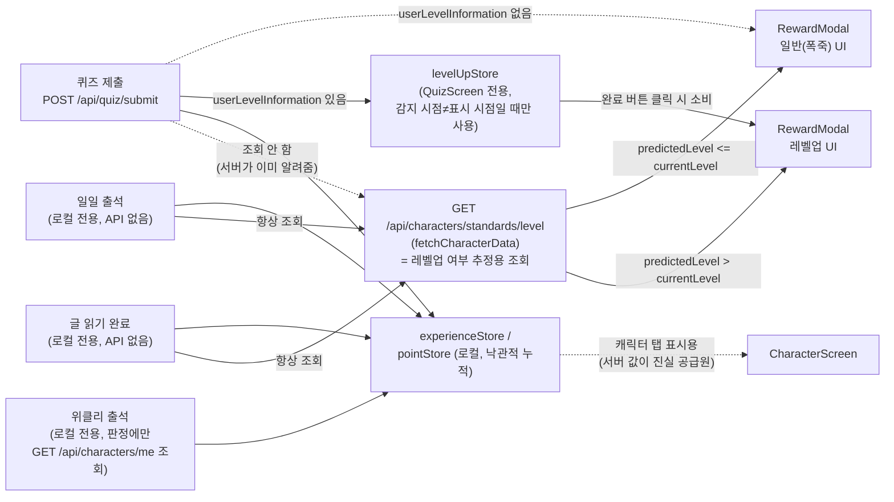
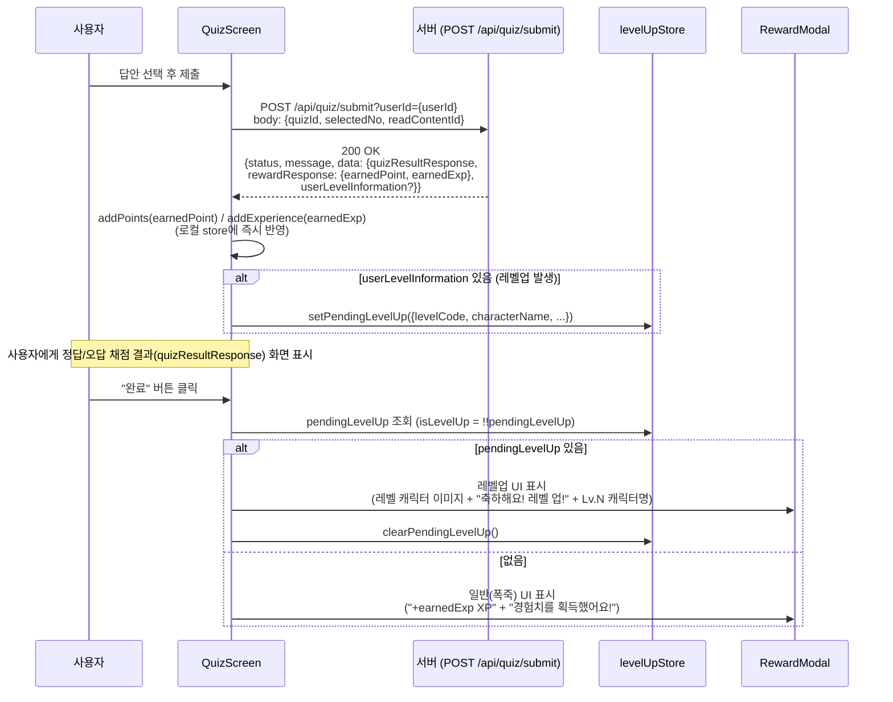
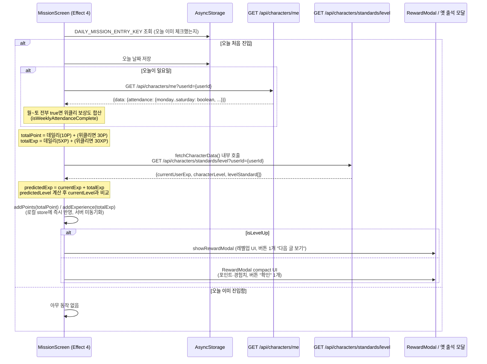
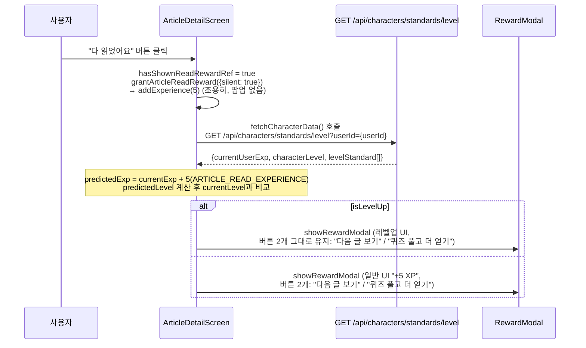

# 레벨/경험치 플로우

> 최종 갱신: 2026-08-31. 이 문서는 "지금 코드가 실제로 어떻게 동작하는가"를 최대한 상세히 기록합니다.
> 팀이 확정한 최종 목표 아키텍처("전역 모달(포인트+레벨업) 플로우")와, 그중 아직 구현되지 않은 부분(임시 조치로 대체된 부분)을 구분해서 읽어주세요.

## 목차

1. [한눈에 보는 요약](#한눈에-보는-요약)
2. [전체 아키텍처](#전체-아키텍처)
3. [데이터 소스 3층 구조](#데이터-소스-3층-구조)
4. [액션별 상세 흐름](#액션별-상세-흐름)
   - [4.1 퀴즈 제출 (정식 지원)](#41-퀴즈-제출-정식-지원)
   - [4.2 일일·위클리 출석 (클라이언트 추정 임시 조치)](#42-일일위클리-출석-클라이언트-추정-임시-조치)
   - [4.3 글 읽기 완료 (클라이언트 추정 임시 조치)](#43-글-읽기-완료-클라이언트-추정-임시-조치)
5. [클라이언트 레벨업 추정 알고리즘 상세](#클라이언트-레벨업-추정-알고리즘-상세)
6. [현재 구조의 문제점 총정리](#현재-구조의-문제점-총정리)
7. [팀 확정 목표 아키텍처 vs 현재 구현 상태](#팀-확정-목표-아키텍처-vs-현재-구현-상태)
8. [이전 구조와 바꾼 이유](#이전-구조와-바꾼-이유)
9. [백엔드 API 레퍼런스 (레벨 관련 전체)](#백엔드-api-레퍼런스-레벨-관련-전체)
10. [알려진 제약 / 향후 확장](#알려진-제약--향후-확장)
11. [주요 파일](#주요-파일)

<br />

## 한눈에 보는 요약

- 레벨업을 유발할 수 있는 액션은 **퀴즈 제출, 일일 출석, 위클리 출석, 글 읽기 완료** 4가지입니다.
- 이 중 **서버가 레벨업 여부를 직접 알려주는 API 응답은 `submitQuiz` 하나뿐**입니다. 나머지 3개(출석 2종 + 글 읽기)는 애초에 "보상 지급"을 서버에 알리는 API 자체가 없어서, 서버가 레벨업을 계산하거나 통보할 방법이 구조적으로 없습니다.
- 그래서 출석·글 읽기는 **클라이언트가 서버의 현재 경험치/레벨 기준표를 조회해서, 이번에 로컬로 더할 경험치를 가산한 뒤 레벨 경계를 넘는지 스스로 계산**하는 방식(추정)으로 임시 처리되어 있습니다 (2026-08-30 추가).
- 레벨업 UI는 4곳(퀴즈/출석/글 읽기/설정 미리보기)에서 공용 컴포넌트 `RewardModal`을 재사용하지만, 레벨업 판단 로직과 모달에 넘기는 props 구성 코드는 **화면마다 따로 작성되어 있어 상당 부분 중복**됩니다.
- 보상 UI는 공용 `RewardModal`로 통일됐습니다. 레벨업과 글 읽기는 2단 `split`, 출석·퀴즈의 일반 포인트/경험치 모달은 단일 흰 카드 `compact` 레이아웃을 사용합니다. 다만 서버 지급·잔액 동기화와 전역 보상 큐는 아직 미구현이며, 목표 구조는 [`REWARD_SYSTEM_DESIGN.md`](./REWARD_SYSTEM_DESIGN.md)에 정리했습니다.

<br />

## 전체 아키텍처



**읽는 법**: 퀴즈는 왼쪽 실선 경로(서버가 직접 알려줌)로 가고, 출석·글 읽기는 매번 별도로 `fetchCharacterData`를 호출해 레벨업 여부를 스스로 계산한 뒤(점선이 아니라 "항상 조회" 실선) 결과에 따라 레벨업 UI/일반 UI 중 하나로 분기합니다.

<br />

## 데이터 소스 3층 구조

레벨업과 관련된 데이터는 성격이 다른 3개 층으로 나뉘고, 각 층의 소스가 다릅니다. 이 구분을 모르면 "왜 경험치 값이 화면마다 다르게 보이지?" 같은 혼란이 생기기 쉽습니다.

| 층                 | 내용                                     | 소스                                                                                | 진실 공급원 여부                                                                                   |
| ------------------ | ---------------------------------------- | ----------------------------------------------------------------------------------- | -------------------------------------------------------------------------------------------------- |
| ① 현재 레벨        | "지금 몇 레벨인가"                       | `useCharacterMe()` → `userGrowthInfo.levelEnum` (예: `"LEVEL_3"`)                   | ✅ 서버가 진실 공급원                                                                              |
| ② 레벨별 표시 정보 | 레벨별 캐릭터 이름/이미지/타이틀 문구    | `src/screens/character/criteria/level/levelData.ts`의 `levelList` (로컬 하드코딩)   | ❌ 로컬 고정값                                                                                     |
| ③ 경험치 누적값    | "지금 경험치가 몇인가"                   | `experienceStore`(zustand, 클라이언트가 낙관적으로 누적)                            | ⚠️ 부분적 — 로컬 전용 보상(출석/글 읽기)이 섞여 있어 서버 `currentExp`와 항상 일치한다는 보장 없음 |
| ④ 레벨 기준표      | "레벨 N이 되려면 경험치가 얼마 필요한가" | `fetchCharacterLevel`(`GET /api/characters/standards/level`)의 `levelStandard` 배열 | ✅ 서버가 진실 공급원                                                                              |

레벨업 **판단**에는 ①(현재 레벨, 서버)과 ④(레벨 기준표, 서버)를 쓰고, 레벨업 **화면 표시**에는 ②(로컬 `levelData.ts`)를 씁니다. 즉 "레벨업했다/안 했다"는 서버 값 기반으로 계산하지만, 그 결과를 그려주는 이미지·이름·문구는 로컬 상수에서 가져옵니다 — 서버가 캐릭터 리뉴얼 등으로 레벨 표시 정보를 바꾸면 앱 업데이트 없이는 반영되지 않습니다.

<br />

## 액션별 상세 흐름

### 4.1 퀴즈 제출 (정식 지원)

유일하게 서버가 레벨업 여부를 직접 알려주는 경로입니다.



**요청/응답 상세**:

- 엔드포인트: `POST /api/quiz/submit?userId={userId}`
- 요청 바디(`SubmitQuizRequest`): `{ quizId: number, selectedNo: number, readContentId: number }`
- 응답(`SubmitQuizApiResponse.data`, 타입 `SubmitQuizData`):
  - `quizResultResponse: { quizId, selectedNo, isAnswerCorrect, correctChoiceNo, correctChoiceText }` — 채점 결과
  - `rewardResponse: { earnedPoint: number, earnedExp: number }` — 이번 제출로 획득한 포인트/경험치 (정답 30P/25XP, 오답 10P/15XP — `DEFAULT_REWARDS_CONFIG` 참고. 단 실제 지급값은 이 응답의 `earnedPoint`/`earnedExp`를 그대로 신뢰함)
  - `userLevelInformation?: { title, message, profileUrl, levelCode, characterName }` — **레벨업이 발생했을 때만 존재**. 없으면(`undefined`) 레벨업이 아님.

**왜 감지 시점과 표시 시점이 다른가**: `addPoints`/`addExperience`는 API 응답을 받는 즉시 호출되지만, 사용자는 아직 정답/오답 피드백 화면을 보고 있는 중이라 레벨업 모달을 바로 띄울 수 없습니다. 그래서 감지 결과(`userLevelInformation`)를 `levelUpStore`에 잠깐 보관해뒀다가, 사용자가 "완료" 버튼을 눌러 리워드 모달을 띄우는 시점에 꺼내 씁니다. 이게 `levelUpStore`가 존재하는 유일한 이유이며, 출석/글 읽기는 감지와 표시가 같은 함수 안에서 동기적으로 끝나기 때문에 이 store를 쓰지 않습니다.

리워드 칩(포인트/경험치 표시)과 하단 버튼("다음 글 보기" / "지금은 괜찮아요") 구성·동작은 레벨업 여부와 무관하게 동일합니다. 바뀌는 건 상단 이미지와 문구뿐입니다.

<br />

### 4.2 일일·위클리 출석 (클라이언트 추정, 임시 조치)

`MissionScreen`의 Effect 4("일일 출석 체크")에서 처리됩니다. 화면 진입 시 오늘 처음 진입인지 AsyncStorage로 판단하고, 처음이면 아래 흐름이 실행됩니다.



**요청/응답 상세**:

- 출석 자체를 서버에 알리는 API는 **없습니다.** (`POST` 형태의 체크인 API를 코드 전체에서 검색해도 존재하지 않음 — 서버가 출석을 어떻게 자체 판단하는지는 클라이언트 코드로는 알 수 없음, 아래 [문제점](#현재-구조의-문제점-총정리) 참고)
- 위클리 판정에만 `GET /api/characters/me?userId={userId}` 호출 (`fetchCharacterMe`). 응답: `{ status, message?, data: { userGrowthInfo, attendance: WeeklyAttendance, missions } }`. 이 중 `attendance: { monday, tuesday, wednesday, thursday, friday, saturday, sunday }` (전부 boolean)만 사용.
- 레벨업 추정에 `GET /api/characters/standards/level?userId={userId}` 호출(`fetchCharacterLevel`, `fetchCharacterData`가 감쌈). 응답: `{ currentUserExp: number, characterLevel: string("LEVEL_N"), levelStandard: [{characterLevel, characterName, characterImgUrl, exp, lv1Message}] }` (오름차순 배열).
- 지급 자체는 **로컬 전용**: `addPoints(totalPoint)` / `addExperience(totalExp)`로 `pointStore`/`experienceStore`만 갱신. 서버에 "출석 보상 지급했다"고 알리는 API 호출이 없음.
- 지급 기준값: `DAILY_ATTENDANCE_POINT=10, DAILY_ATTENDANCE_EXPERIENCE=5, WEEKLY_ATTENDANCE_POINT=30, WEEKLY_ATTENDANCE_EXPERIENCE=30` (`src/config/rewards.ts`의 `DEFAULT_REWARDS_CONFIG`, 전부 하드코딩값).

**레벨업일 때와 아닐 때 모두 같은 공용 컴포넌트를 사용합니다**: 레벨업이면 `RewardModal`의 `split`, 일반 출석이면 `compact` 레이아웃을 사용합니다. 일반 출석은 포인트·경험치 칩과 `확인` 버튼 하나를 표시합니다.

<br />

### 4.3 글 읽기 완료 (클라이언트 추정, 임시 조치)

`ArticleDetailScreen`의 `handlePressDoneReadingButton`("다 읽었어요" 버튼)에서 처리됩니다. 글 읽기는 출석과 달리 **보상 지급 경로가 2개**라는 점이 먼저 이해되어야 합니다.

**경로 A — "다 읽었어요" 버튼 클릭 (이번 임시 조치의 대상)**:



**경로 B — 퀴즈 풀지 않고 화면 이탈 (이번 임시 조치 대상 아님, 기존 방식 그대로)**:

`useFocusEffect`의 cleanup에서 `hasShownReadRewardRef.current`가 `false`일 때만 `grantArticleReadReward({ silent: false })`가 실행되어, 옛 `showModal` + `ExperienceModalContent`(버튼 "확인" 1개)로 "+5 XP" 팝업만 보여줍니다. 이 경로는 레벨업 UI 자체가 없습니다 — 레벨업 여부를 계산하지 않고 항상 일반 경험치 팝업만 뜹니다.

**요청/응답 상세 (경로 A)**:

- 글 읽기 보상을 서버에 알리는 API는 **없습니다.**
- 대신 **`fetchContentDetail`(`GET /api/content/:contentId?userId={userId}&isFromHome={isFromHome}`) 호출 자체가 서버 쪽 "완독 처리"를 겸합니다** — 이 API는 화면 진입 시(Effect 1)에 글 내용을 불러오기 위해 호출되는데, 이 호출 자체가 서버 DB에 "이 유저가 이 글을 읽었다"고 기록합니다(마이페이지의 "읽은 글" 목록에 퀴즈를 안 푼 글도 나오는 이유). 하지만 **이 API는 보상(포인트/경험치)에 대해서는 아무것도 응답하지 않습니다** — 순수하게 "읽음" 여부만 서버에 남기고, 보상 지급은 완전히 별개로 클라이언트가 로컬에서 처리합니다.
- 레벨업 추정에 `GET /api/characters/standards/level?userId={userId}` 호출 (MissionScreen과 동일한 API, 동일한 알고리즘).
- 지급 자체는 로컬 전용: `addExperience(ARTICLE_READ_EXPERIENCE)` (5XP). AsyncStorage 키 `@article_read_reward_{articleId}`로 글당 평생 1회만 지급되도록 dedup.
- 리워드 칩에는 `{ label: '글 읽기', value: 5 }`만 표시 — 이 시점에 실제로 지급되는 보상이 글 읽기 경험치 하나뿐이기 때문(미션 완료 등 다른 보상은 여기서 지급되지 않음).

**버튼 구성이 출석/퀴즈와 다른 이유**: 팀이 공유한 다이어그램에서, 퀴즈·출석의 레벨업 모달은 버튼 1개("다음 글 보기")로 줄어들지만 **글 읽기의 레벨업 모달만 예외적으로 일반 모달과 동일하게 버튼 2개("다음 글 보기"+"퀴즈 풀고 더 얻기")를 유지**하도록 명시되어 있습니다(사용자 확인, 2026-08-30). 코드에서도 `onNextArticle`/`onMoreQuiz`/`onDismiss`를 레벨업 여부와 무관하게 동일하게 넘겨서 이를 구현했습니다.

<br />

## 클라이언트 레벨업 추정 알고리즘 상세

출석(`MissionScreen`)과 글 읽기(`ArticleDetailScreen`)는 **완전히 동일한 알고리즘을 각자 파일에 중복 구현**하고 있습니다.

```
1. try { const { currentLevel, currentExp, levelStandard } = await fetchCharacterData() }
   - fetchCharacterData는 내부적으로 fetchCharacterLevel(GET /api/characters/standards/level)을 호출하고
     그 응답을 가공해서 { currentLevel(number), currentExp(number), nextLevelExp, levelStandard } 형태로 반환
   - 실패 시(네트워크 에러 등) catch에서 isLevelUp = false로 유지, 기존 일반 모달 그대로 표시
     (레벨업 판단만 실패한 것으로 간주 — 포인트/경험치 지급 자체는 이미 끝난 뒤라 막지 않음)

2. if (levelStandard && levelStandard.length > 0):
     predictedExp = currentExp + 이번에_지급될_경험치
       - 출석: totalExp (데일리 5 + 위클리 조건부 30)
       - 글 읽기: ARTICLE_READ_EXPERIENCE (5, 고정)

3. levelStandard는 오름차순 배열 → 뒤에서부터(높은 레벨부터) 역순 순회:
     for (i = levelStandard.length - 1; i >= 0; i--):
       if (predictedExp >= levelStandard[i].exp):
         predictedStandard = levelStandard[i]
         break
   (= predictedExp로 도달 가능한 "가장 높은" 레벨 기준을 찾음)

4. predictedStandard.characterLevel(예: "LEVEL_4")을 정규식 /LEVEL_(\d+)/로 파싱 → predictedLevel(number)

5. if (predictedLevel && predictedLevel > currentLevel):
     isLevelUp = true
     newLevelData = levelList.find(level => level.id === predictedLevel)  // 로컬 levelData.ts에서 표시 정보 조회
```

**핵심 전제와 위험**: 이 알고리즘은 "서버가 아는 현재 경험치(`currentExp`, 이번 액션 이전 상태) + 클라이언트가 지금 더하려는 경험치 = 서버가 나중에 계산할 실제 값"이라고 **가정**합니다. 이 가정이 깨지는 경우:

- 서버가 레벨업 판정에 클라이언트가 모르는 추가 로직(보너스 배수, 이벤트 캡 등)을 쓰는 경우 → 예측이 틀림
- `fetchCharacterData` 호출과 실제 서버 반영 사이에 다른 액션(다른 기기에서의 동시 요청 등)으로 경험치가 이미 바뀐 경우 → race condition으로 예측이 틀림
- 애초에 이 예측이 서버에 실제로 반영되는 게 전혀 아님 — **`addExperience`/`addPoints`가 로컬 store만 올릴 뿐 서버에 "지급했다"고 알리는 API가 없으므로, 서버의 진짜 경험치는 이 액션으로 전혀 바뀌지 않습니다.** 즉 이번 추정은 "만약 서버도 이만큼을 인정한다면 레벨업일 것이다"라는 시뮬레이션이지, 서버에 실제로 반영시키는 절차가 아닙니다.

<br />

## 현재 구조의 문제점 총정리

1. **서버 미동기화 (구조적 문제, 가장 근본적)**: 출석·글 읽기의 포인트/경험치 지급이 서버에 전혀 통보되지 않습니다. `addPoints`/`addExperience`는 클라이언트 zustand store만 변경합니다. 그 결과:
   - 서버의 진짜 `currentExp`/`currentPoint`는 이 액션들로 전혀 늘어나지 않습니다 (퀴즈만 실제로 서버 값이 늘어남).
   - 화면에 표시되는 값(`CharacterScreen` 등)은 항상 서버를 다시 조회해서 그리므로, **로컬 store에 쌓인 값은 화면에 직접 노출되지 않아 표시상 불일치는 드러나지 않습니다.** 하지만 이는 "출석/글 읽기로 실제 레벨이 올랐다"는 사실 자체가 서버에는 존재하지 않는다는 뜻이기도 합니다 — 클라이언트가 레벨업 모달을 보여줘도, 서버 쪽 `userGrowthInfo.levelEnum`은 그대로일 수 있습니다.
2. **레벨업 예측이 실제 반영과 무관함**: 위 알고리즘 섹션 참고. 클라이언트가 "레벨업이다"라고 판단해서 축하 모달을 띄워도, 서버가 실제로 그렇게 계산한다는 보장이 없습니다. 정식 해결 전까지는 UX상의 예측 연출에 가깝습니다.
3. **서버·프론트가 출석을 각각 독립적으로 처리함** (팀 공유 플로우차트에 명시된 이슈): 서버는 `GET /api/characters/me`의 `attendance` 필드로 자체 출석 기록을 갖고 있지만, **이 기록이 언제·어떻게 채워지는지 클라이언트 코드에는 전혀 없습니다** (체크인 API가 존재하지 않음). 반면 클라이언트는 `DAILY_MISSION_ENTRY_KEY`(AsyncStorage)라는 완전히 별개의 로컬 판정 기준으로 "오늘 출석했다"를 판단해서 포인트/경험치를 지급합니다. 즉 "출석했다"는 사실이 서버 기준과 클라이언트 기준으로 이원화되어 있고, 둘이 항상 같은 결론을 낸다는 보장이 없습니다. 위클리 보상 판정에서만 서버의 `attendance`를 참조하므로, 이 부분에서 두 기준이 어긋나면 위클리 보상이 예상과 다르게 지급될 수 있습니다.
4. **코드 중복**: `QuizScreen`/`MissionScreen`/`ArticleDetailScreen`/`SettingScreen` 4곳에 레벨업 모달을 만드는 JSX·스타일(이미지 사이즈/오프셋, 캡션+타이틀 텍스트, "+XP" 문구 스타일 등)이 거의 동일하게 중복돼 있고, `MissionScreen`/`ArticleDetailScreen`은 레벨업 추정 알고리즘 자체도 그대로 중복돼 있습니다.
5. **`LevelUpInfo` 죽은 타입 / 문서와 실제 코드의 불일치**: `missionApi.ts`의 `LevelUpInfo` 인터페이스는 주석에 "완독 체크 또는 퀴즈 제출 응답에서 레벨업이 발생한 경우 포함됨"이라고 적혀 있지만, **"완독 체크"라는 API 자체가 코드에 존재하지 않습니다.** 이 타입은 실제로 어디에서도 사용되지 않는 죽은 코드로 보이며, 아마도 미래에 계획됐다가 구현되지 않은 API에 대한 잔재 문서로 추정됩니다. (실제로 쓰이는 타입은 `SubmitQuizData.userLevelInformation: UserLevelInformation`이며, 이름이 비슷해서 혼동하기 쉽습니다.)
6. **`showLevelUpModal` 필드 미사용**: `characterApi.ts`의 `UserGrowthInfo.showLevelUpModal: boolean` 필드가 타입에는 정의돼 있지만 코드 어디에서도 읽어서 쓰지 않습니다. 백엔드가 이미 준비해둔 신호일 가능성이 있어 보이나, 실제로 서버가 이 값을 채워주는지·정확한 의미(한 번 보여주면 꺼지는 플래그인지, 매 응답마다 재계산되는 값인지 등)는 백엔드 확인이 필요합니다. 만약 이 필드가 신뢰할 수 있다면, 지금의 클라이언트 추정 알고리즘 전체를 대체할 수도 있는 잠재적 해결책입니다.
7. **경험치 값 자체의 신뢰도**: `experienceStore`는 로컬 전용 보상(출석/글 읽기)과 서버 값(퀴즈)이 뒤섞여 누적되므로, 서버 `currentExp`와 항상 정확히 일치한다는 보장이 없습니다. 다만 화면 표시는 항상 서버를 재조회하므로 표시 불일치로 직접 드러나지는 않습니다 (자세한 내용은 [`docs/POINT_FLOW.md`](./POINT_FLOW.md) 참고, 포인트에 대해서도 동일한 구조적 특성이 있음).

<br />

## 팀 확정 목표 아키텍처 vs 현재 구현 상태

팀 회의에서 공유된 플로우차트("전역 모달(포인트+레벨업) 플로우")의 핵심 아이디어는 **포인트가 발생하는 모든 액션(출석/글 읽기/퀴즈)이 각자 레벨업 여부를 분기해서 레벨업 모달 또는 포인트 모달을 보여주는 구조**이며, 서버·프론트가 출석을 각각 처리하고 있는 문제도 다이어그램에 명시적으로 표시되어 있었습니다. 이번 라운드에서 사용자에게 직접 확인받은 적용 범위는 다음과 같습니다(2026-08-30):

| 항목                               | 목표(다이어그램)                                            | 현재 구현                                                                                        | 상태                         |
| ---------------------------------- | ----------------------------------------------------------- | ------------------------------------------------------------------------------------------------ | ---------------------------- |
| 퀴즈 레벨업 모달                   | RewardModal 계열, 버튼 1개                                  | `RewardModal`, 버튼 1개                                                                          | ✅ 완료                      |
| 출석 레벨업 모달                   | RewardModal 계열, 버튼 1개                                  | `RewardModal`, 버튼 1개 (클라이언트 추정 기반)                                                   | ⚠️ 임시 조치로 완료          |
| 글 읽기 레벨업 모달                | RewardModal 계열, **버튼 2개 유지**                         | `RewardModal`, 버튼 2개 (클라이언트 추정 기반)                                                   | ⚠️ 임시 조치로 완료          |
| 출석의 일반(레벨업 아님) 모달      | 단일 흰 카드 포인트·경험치 모달                             | `RewardModal`의 `compact` 레이아웃, 버튼 `확인`                                                  | ✅ 완료                      |
| 글 읽기의 일반(레벨업 아님) 모달   | RewardModal 계열                                            | 이미 `RewardModal` 사용 중 (레벨업 이전부터)                                                     | ✅ 기존에 완료돼 있었음      |
| 서버·프론트 출석 이원화 문제       | (다이어그램에 문제로 명시, 해결책은 미정)                   | 미해결 — 클라이언트는 `DAILY_MISSION_ENTRY_KEY`, 서버는 자체 `attendance` 기록을 독립적으로 유지 | 🔲 미해결, 다음 팀 회의 안건 |
| 레벨업 판단을 서버 API가 직접 응답 | 모든 보상 API가 `userLevelInformation`류 필드를 응답에 포함 | 퀴즈만 해당, 출석/글 읽기는 클라이언트 추정                                                      | 🔲 백엔드 작업 필요 (미착수) |

<br />

## 이전 구조와 바꾼 이유

**예전 구조**: `RootNavigator`가 전역에서 `experience` 값 변화를 감시하다가, AsyncStorage의 `@pending_level_up` 키가 있으면 별도 모달(`showModal` + `LevelUpModalContent`)을 띄웠습니다. 이 키는 퀴즈 제출 시에만 기록됐습니다.

**문제점**:

1. `experience`는 전역 store라 퀴즈 제출 시 `addExperience()`가 호출되는 순간 바로 effect가 실행됩니다. 그런데 사용자는 아직 정답/오답 피드백 화면도 보지 못한 시점이라, 화면 전환 전에 레벨업 팝업이 먼저 튀어나오는 문제가 있었습니다.
2. 이후 사용자가 "완료" 버튼을 눌러 QuizScreen 자체 리워드 모달을 띄우면, 방금 뜬 레벨업 모달과 이중으로 겹쳐 노출됐습니다.
3. `experience`는 소스와 무관한 전역 값이기 때문에, 퀴즈가 아닌 다른 액션(출석 등)으로 경험치가 올라도 감시 effect 자체는 실행됩니다. 다만 실제 레벨업 여부 판단은 여전히 퀴즈가 남긴 `@pending_level_up` 값에만 의존했습니다. 즉, 어떤 이유로 이 플래그가 곧바로 소비되지 못하고 AsyncStorage에 남아있었다면, 그 다음 번 경험치 변화(예: 다음 날 출석 체크) 시점에 뒤늦게 튀어나올 수 있었습니다.
   - **"출석으로 레벨업했는데 홈에서 레벨업 모달이 떴다"는 이전 테스트 관찰은 이 케이스였을 가능성이 높습니다.** 출석 자체가 레벨업을 감지한 게 아니라, 이전 퀴즈 세션에서 남아있던 플래그가 무관한 타이밍에 뒤늦게 소비된 것으로 추정됩니다 (출석 API에는 애초에 레벨업 정보가 없습니다).

**현재 구조**: 각 화면이 자기 보상을 지급하는 시점에 레벨업 여부를 판단(퀴즈는 서버 응답으로, 출석·글 읽기는 클라이언트 추정으로)하고, 자기 리워드 모달을 띄우는 시점에 바로 UI만 전환합니다. 표시 순서가 화면 자체 로직에 종속되므로 위 1)·2)번 문제가 구조적으로 재발하지 않습니다. 3)번 문제(전역 플래그가 엉뚱한 시점에 소비됨)도 전역 감시 effect 자체가 사라졌으므로 재발하지 않습니다.

<br />

## 백엔드 API 레퍼런스 (레벨 관련 전체)

"레벨"이라는 데이터를 다루는 API 호출 지점은 아래가 전부입니다 (레벨업 알림 여부와 무관하게).

### `POST /api/quiz/submit?userId={userId}`

- 함수: `submitQuiz` (`src/api/missionApi.ts`)
- 요청 바디: `{ quizId: number, selectedNo: number, readContentId: number }`
- 응답: `{ status, message, data: { quizResultResponse: { quizId, selectedNo, isAnswerCorrect, correctChoiceNo, correctChoiceText }, rewardResponse: { earnedPoint, earnedExp }, userLevelInformation?: { title, message, profileUrl, levelCode, characterName } } }`
- **레벨업 여부를 서버가 직접 알려주는 유일한 API.**

### `GET /api/characters/me?userId={userId}`

- 함수: `fetchCharacterMe` (`useCharacterMe` 훅으로 감쌈), `src/api/characterApi.ts`
- 응답: `{ status, message?, data: { userGrowthInfo: { levelName, levelEnum, characterVideoUrl, progressPercent, currentExp, currentPoint, showLevelUpModal }, attendance: { monday, tuesday, wednesday, thursday, friday, saturday, sunday }, missions: [{ missionType, title, currentProgress, targetGoal, isCompleted, isLocked }] } }`
- `userGrowthInfo.levelEnum`("LEVEL_N" 형식)이 **현재 레벨의 진실 공급원.**
- `attendance`는 서버가 독립적으로 관리하는 출석 기록 — 위클리 보상 판정에만 사용됨.
- `showLevelUpModal`은 타입에만 존재, 코드에서 미사용 (위 문제점 6번 참고).

### `GET /api/characters/standards/level?userId={userId}`

- 함수: `fetchCharacterLevel` → 이를 가공하는 `fetchCharacterData`(`useCharacterData` 훅), `src/api/characterApi.ts`
- 응답(`CharacterLevelResponse`): `{ currentUserExp: number, characterLevel: string, levelStandard: [{ characterLevel: string, characterName: string, characterImgUrl: string, exp: number, lv1Message: string }] }` (`levelStandard`는 오름차순)
- `fetchCharacterData`가 이를 가공해 `{ currentLevel: number, currentExp: number, nextLevelExp: number, levelStandard }` 형태로 반환. 실패 시 `experienceStore`의 로컬 값으로 fallback(`currentLevel: 1` 고정).
- 출석/글 읽기의 **레벨업 클라이언트 추정에 사용되는 핵심 API.** `CharacterScreen`의 경험치 바 계산, `MyPageScreen`의 프로필 이미지 선택(레벨에 맞는 캐릭터 고르기)에도 사용됨.

### `GET /api/characters/standards/reward` (죽은 코드)

- 함수: `fetchCharacterReward`, `src/api/characterApi.ts`
- 응답: `{ aboutPointExpInformation: { rewardType, description }, rewardDataResponse: { rewardItem, exp, point } }`
- **코드 전체에서 어디에서도 호출되지 않는 미사용 함수.** 각 행동별 리워드 기준 정보를 서버에서 받아올 수 있는 API로 보이나 실제로는 쓰이지 않고, `src/config/rewards.ts`의 하드코딩값이 대신 쓰임.

> **주의**: `src/api/userApi.ts`에도 "level"이 등장하지만(`LevelCategory`: BEGINNER/INTERMEDIATE/ADVANCED, `updateUserLevel`, `/api/levels/:level`), 이건 온보딩에서 고르는 **콘텐츠 난이도** 설정이라 캐릭터 성장 레벨과는 이름만 같을 뿐 완전히 다른 시스템입니다.

<br />

## 알려진 제약 / 향후 확장

- 출석·글 읽기는 클라이언트 추정으로 지원되지만, 정식 해결은 아닙니다.
- 확장하려면 각 보상 관련 지점(출석 체크, 완독 처리)이 퀴즈의 `userLevelInformation`과 동일한 형태의 필드를 응답에 포함하도록 백엔드 작업이 먼저 필요합니다. 그 후 해당 화면에서 `levelUpStore.setPendingLevelUp()` 호출만 추가하면, 모달 UI 전환 로직은 이미 공용으로 재사용 가능합니다 (출석·글 읽기도 이 방식으로 전환하면 클라이언트 추정 로직을 걷어낼 수 있음).
- 지금은 QuizScreen/MissionScreen/ArticleDetailScreen 세 화면에 레벨업 모달을 만드는 JSX/스타일이 거의 동일하게 중복돼 있습니다. 공용 감지 유틸/모달 props 빌더로 뽑아내는 리팩터가 필요합니다 — 팀 회의에서 논의 예정.
- `UserGrowthInfo.showLevelUpModal` 필드가 실제로 채워지고 있는지, 정확한 의미(한 번 보여주면 꺼지는 플래그인지 등)는 백엔드 확인이 필요합니다. 신뢰할 수 있다면 클라이언트 추정 알고리즘을 대체할 잠재적 해결책입니다.
- 서버·프론트가 출석을 각각 독립적으로 판정하는 이원화 구조는 아직 미해결이며, 다음 팀 회의 안건입니다.
- 설정 화면(`SettingScreen`)의 "레벨업 모달 다시 보기"로 실제 보상 지급 없이 레벨업 UI만 미리 확인할 수 있습니다(도움말 섹션).

<br />

## 주요 파일

- `src/store/levelUpStore.ts` — 레벨업 정보를 담아두는 전역 store (QuizScreen 전용)
- `src/store/experienceStore.ts`, `src/store/pointStore.ts` — 경험치/포인트 로컬 상태
- `src/screens/common/QuizScreen.tsx` — 서버 `userLevelInformation`으로 레벨업을 정식 소비하는 화면
- `src/screens/common/ArticleDetailScreen.tsx` — 글 읽기 보상, `fetchCharacterData`로 레벨업을 임시 추정 ("다 읽었어요" 경로만 — 이탈 경로는 미지원)
- `src/screens/main/MissionScreen.tsx` — 출석 보상, `fetchCharacterData`로 레벨업을 임시 추정 (`RewardModal`의 split/compact 사용)
- `src/screens/myPage/SettingScreen.tsx` — "레벨업 모달 다시 보기"(도움말 섹션) — 실제 지급 없이 UI만 미리보기
- `src/screens/character/criteria/level/levelData.ts` — 레벨별 표시 정보(로컬 소스)
- `src/api/missionApi.ts` — `SubmitQuizData.userLevelInformation` 타입 정의, 미사용 `LevelUpInfo` 타입
- `src/api/characterApi.ts` — `UserGrowthInfo`(서버 레벨 진실 공급원), 미사용 `showLevelUpModal` 필드, `fetchCharacterLevel`/`fetchCharacterData`(레벨 기준표·경험치 조회)
- `src/hooks/useCharacter.ts` — `useCharacterMe`, `useCharacterData` 등 캐릭터/레벨 관련 훅 모음
- `src/components/RewardModal.tsx` — 폭죽/레벨업 공용 2단 카드 모달 컴포넌트
- `src/config/rewards.ts` — 지급 기준값(`DEFAULT_REWARDS_CONFIG`), 전부 하드코딩
