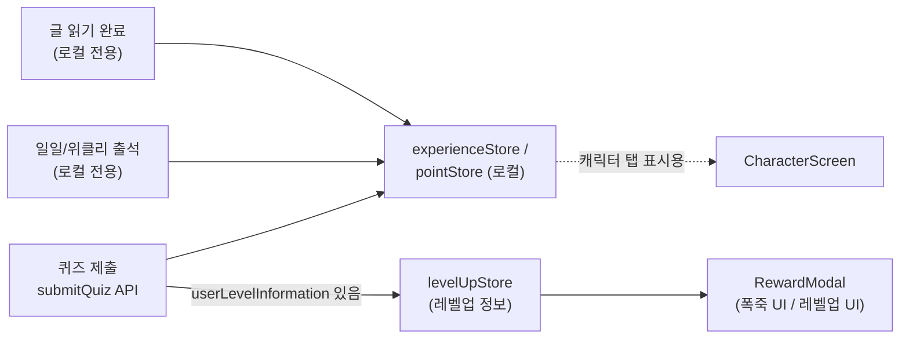
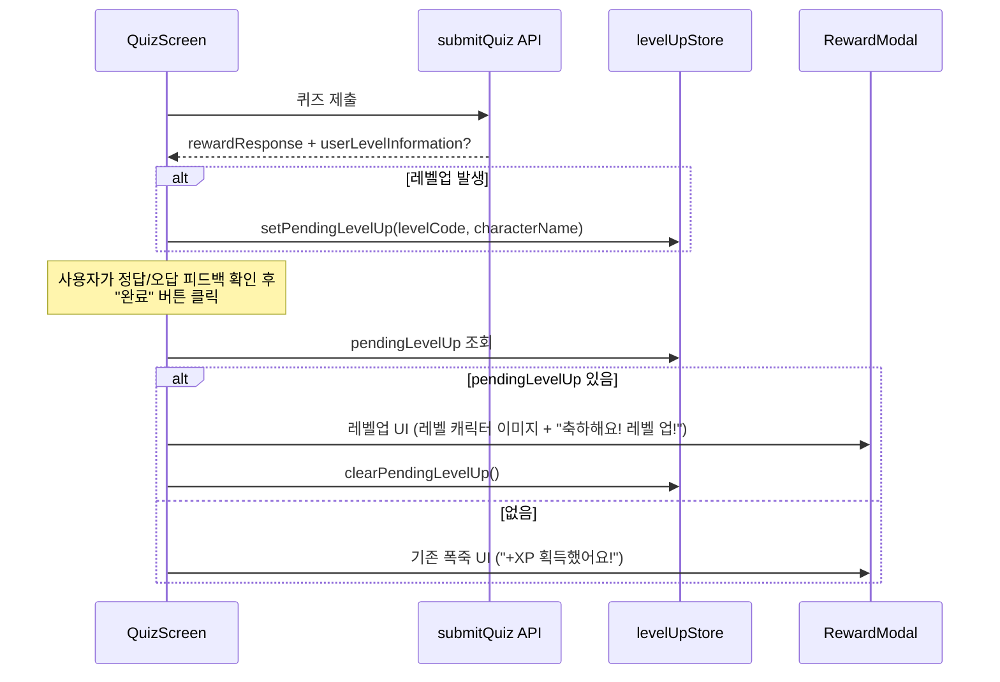
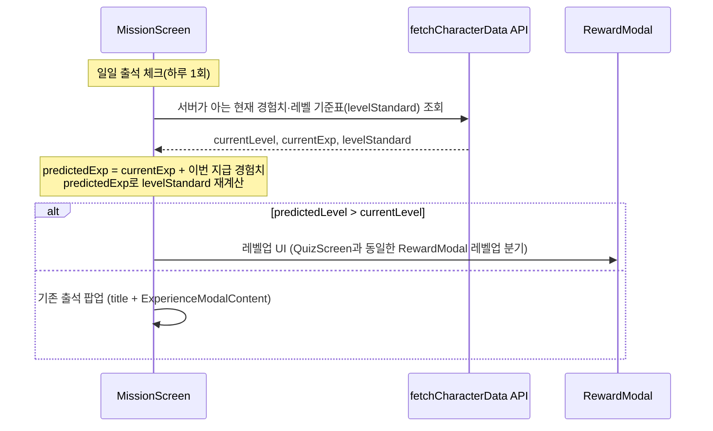

# 레벨/경험치 플로우

## 개요

경험치(XP)·포인트는 글 읽기, 퀴즈, 일일/위클리 출석 네 가지 액션에서 지급됩니다. 이 중 **퀴즈 제출만 실제 서버 API 응답**이고, 나머지는 로컬(클라이언트)에서만 값을 올립니다. 레벨업 알림(모달)은 퀴즈 경로에서 정식으로 지원되고, 출석 경로는 클라이언트 추정을 통한 임시 조치로 지원됩니다 (아래 참고). 글 읽기는 여전히 미지원입니다.

 

## 경험치/포인트 지급 소스별 정리

| 소스 | 서버 API 호출 | 레벨업 정보 포함 | 지급 위치 |
| --- | --- | --- | --- |
| 글 읽기 완료 | ❌ 없음 | ❌ 불가 | `ArticleDetailScreen.grantArticleReadReward` |
| 퀴즈 제출 | ✅ `submitQuiz` | ✅ `userLevelInformation` (서버가 직접 알려줌) | `QuizScreen` 제출 핸들러 |
| 일일 출석 | ❌ 없음 (레벨업 추정용으로 `fetchCharacterData`, 위클리 판정용으로 `fetchCharacterMe` 조회) | ⚠️ 클라이언트 추정 (임시 조치) | `MissionScreen` Effect 4 (일일 출석 체크) |
| 위클리 출석 | 위와 동일 | ⚠️ 위와 동일 | 위와 동일 |

글 읽기/출석은 서버에 보상 지급을 알리는 API 자체가 없고 `addExperience()`/`addPoints()`로 로컬 store만 올리기 때문에, **서버가 "레벨업했다"고 알려줄 방법이 구조적으로 없습니다.** 레벨업 정보(`userLevelInformation`)를 실제로 내려주는 API는 `submitQuiz` 하나뿐입니다.

다만 출석은 임시 조치로 클라이언트 추정을 통해 레벨업 알림을 지원합니다 — 아래 "출석 레벨업 임시 조치" 섹션 참고.

 

## 레벨 자체의 소스: 서버 vs 로컬

레벨업 "판단"과 레벨업 "표시"는 서로 다른 데이터 소스를 씁니다.

- **현재 레벨(진실 공급원)**: 항상 서버 값. `useCharacterMe()`가 내려주는 `userGrowthInfo.levelEnum`("LEVEL_3" 형식)을 파싱해서 사용합니다 (`CharacterScreen.currentLevel` 참고).
- **레벨별 표시 정보(캐릭터 이름/이미지/필요 경험치)**: 로컬 데이터. `src/screens/character/criteria/level/levelData.ts`의 `levelList`에서 레벨 id로 조회합니다.
- **경험치(experience) 값 자체**: `experienceStore`가 클라이언트에서 낙관적으로 누적한 값이라, 서버 `currentExp`와 항상 정확히 일치한다는 보장은 없습니다. 특히 로컬 전용 보상(글 읽기, 출석)은 서버 동기화 없이 더해지기 때문입니다.
- **레벨 기준표(레벨별 필요 경험치)**: 서버 값. `fetchCharacterLevel`(GET `/api/characters/standards/level`)이 `levelStandard`(레벨별 exp 기준 배열)를 내려주고, 이를 감싼 `fetchCharacterData`/`useCharacterData`가 현재 레벨·현재 경험치·다음 레벨까지 필요한 경험치로 가공합니다. `CharacterScreen`의 경험치 바 계산, `MyPageScreen`의 프로필 이미지 선택(레벨에 맞는 캐릭터 고르기)에 사용됩니다.

 

## 레벨 관련 API 한눈에 보기

레벨업 알림과 무관하게, "레벨"이라는 데이터를 다루는 API 호출 지점은 아래 세 곳뿐입니다.

| API | 위치 | 용도 |
| --- | --- | --- |
| `submitQuiz` | `missionApi.ts` | 퀴즈 제출. 레벨업 발생 시에만 `userLevelInformation` 포함 — **레벨업 여부를 서버가 직접 알려주는 유일한 API** |
| `fetchCharacterMe` (`useCharacterMe`) | `characterApi.ts` | `userGrowthInfo.levelEnum` — 현재 레벨의 진실 공급원 |
| `fetchCharacterLevel` → `fetchCharacterData` (`useCharacterData`) | `characterApi.ts` | 레벨 기준표(`levelStandard`)와 현재/다음 레벨 경험치 — 경험치 바, 프로필 이미지 선택 등에 사용 |

즉 "퀴즈"와 "캐릭터" 두 화면 축에서만 레벨 관련 API를 호출하며, 캐릭터 쪽은 위 두 API로 나뉘어 있습니다.

> **주의**: `src/api/userApi.ts`에도 "level"이 등장하지만(`LevelCategory`: BEGINNER/INTERMEDIATE/ADVANCED, `updateUserLevel`, `/api/levels/:level`), 이건 온보딩에서 고르는 **콘텐츠 난이도** 설정이라 캐릭터 성장 레벨과는 이름만 같을 뿐 완전히 다른 시스템입니다.

 

## 레벨업 모달 표시 흐름 (퀴즈: 정식 지원)

리워드 칩(퀴즈/포인트)과 하단 버튼("다음 글 보기" / "지금은 괜찮아요") 구성·동작은 레벨업 여부와 무관하게 동일합니다. 바뀌는 건 상단 이미지와 문구뿐입니다.

 

## 출석 레벨업 임시 조치 (클라이언트 추정)

출석은 보상 지급 API 자체가 없어서 퀴즈처럼 서버가 레벨업 여부를 알려줄 수 없습니다. 정식 해결(출석 보상 API가 레벨업 정보를 응답에 포함하도록 백엔드 작업)이 되기 전까지, `MissionScreen`이 아래처럼 **클라이언트에서 레벨업 여부를 추정**합니다.

- `levelUpStore`를 거치지 않고, 감지와 소비가 `MissionScreen` 안에서 한 번에 끝납니다(퀴즈처럼 다른 화면 진입 시점까지 정보를 들고 있을 필요가 없어서).
- 조회 실패 시에는 안전하게 "레벨업 아님"으로 처리하고 기존 출석 팝업을 그대로 보여줍니다 — 포인트/경험치 지급 자체는 막지 않습니다.
- 리워드 칩 라벨은 퀴즈와 구분되도록 "출석"/"포인트"를 씁니다.
- **한계**: 서버가 실제로 계산하는 레벨업 조건과 클라이언트의 예측이 다를 수 있습니다(동시에 다른 액션으로 경험치가 올랐다거나, 서버 쪽 보정 로직이 있는 경우 등). 어디까지나 임시 추정이며, 진짜 정답은 출석 보상 API가 `userLevelInformation`을 내려주는 것입니다.

 

## 이전 구조와 바꾼 이유

**예전 구조**: `RootNavigator`가 전역에서 `experience` 값 변화를 감시하다가, AsyncStorage의 `@pending_level_up` 키가 있으면 별도 모달(`showModal` + `LevelUpModalContent`)을 띄웠습니다. 이 키는 퀴즈 제출 시에만 기록됐습니다.

**문제점**:

1. `experience`는 전역 store라 퀴즈 제출 시 `addExperience()`가 호출되는 순간 바로 effect가 실행됩니다. 그런데 사용자는 아직 정답/오답 피드백 화면도 보지 못한 시점이라, 화면 전환 전에 레벨업 팝업이 먼저 튀어나오는 문제가 있었습니다.
2. 이후 사용자가 "완료" 버튼을 눌러 QuizScreen 자체 리워드 모달을 띄우면, 방금 뜬 레벨업 모달과 이중으로 겹쳐 노출됐습니다.
3. `experience`는 소스와 무관한 전역 값이기 때문에, **퀴즈가 아닌 다른 액션(출석 등)으로 경험치가 올라도 감시 effect 자체는 실행**됩니다. 다만 실제 레벨업 여부 판단은 여전히 퀴즈가 남긴 `@pending_level_up` 값에만 의존했습니다. 즉, 어떤 이유로 이 플래그가 곧바로 소비되지 못하고 AsyncStorage에 남아있었다면, 그 다음 번 경험치 변화(예: 다음 날 출석 체크) 시점에 뒤늦게 튀어나올 수 있었습니다.
   - **"출석으로 레벨업했는데 홈에서 레벨업 모달이 떴다"는 이전 테스트 관찰은 이 케이스였을 가능성이 높습니다.** 출석 자체가 레벨업을 감지한 게 아니라, 이전 퀴즈 세션에서 남아있던 플래그가 무관한 타이밍에 뒤늦게 소비된 것으로 추정됩니다 (출석 API에는 애초에 레벨업 정보가 없습니다).

**현재 구조**: 각 화면이 자기 보상 API 응답을 받는 시점에 `levelUpStore`에 기록해두고, 자기 리워드 모달을 띄우는 시점에 그 store를 확인해서 UI만 전환합니다. 표시 순서가 화면 자체 로직에 종속되므로 위 1)·2)번 문제가 구조적으로 재발하지 않습니다.

 

## 알려진 제약 / 향후 확장

- 글 읽기는 서버 API 호출이 아예 없어서 **레벨업을 해도 지금은 아무 알림도 뜨지 않습니다.** (버그가 아니라 애초에 감지할 데이터가 없는 상태입니다.)
- 출석은 위 "출석 레벨업 임시 조치"처럼 클라이언트 추정으로 지원되지만, 정식 해결은 아닙니다.
- 확장하려면 각 보상 API(완독 체크, 출석 체크 등)가 퀴즈의 `userLevelInformation`과 동일한 형태의 필드를 응답에 포함하도록 백엔드 작업이 먼저 필요합니다. 그 후 해당 화면에서 `levelUpStore.setPendingLevelUp()` 호출만 추가하면, 모달 UI 전환 로직은 이미 공용으로 재사용 가능합니다. (출석도 이 방식으로 전환하면 클라이언트 추정 로직을 걷어낼 수 있습니다.)
- 참고로 `src/api/characterApi.ts`의 `UserGrowthInfo.showLevelUpModal` 필드가 이미 타입에 정의돼 있지만 현재 어디에서도 읽어서 쓰고 있지 않습니다. 백엔드가 이미 준비해둔 필드일 수 있어 보이니, 실제로 값이 채워지고 있는지·정확한 의미(한 번 보여주면 꺼지는 플래그인지 등)는 백엔드 확인이 필요합니다.
- 설정 화면(`SettingScreen`)의 "레벨업 모달 다시 보기"로 실제 보상 지급 없이 레벨업 UI만 미리 확인할 수 있습니다(도움말 섹션).

 

## 주요 파일

- `src/store/levelUpStore.ts` — 레벨업 정보를 담아두는 전역 store
- `src/store/experienceStore.ts`, `src/store/pointStore.ts` — 경험치/포인트 로컬 상태
- `src/screens/common/QuizScreen.tsx` — 서버 `userLevelInformation`으로 레벨업을 정식 소비하는 화면
- `src/screens/common/ArticleDetailScreen.tsx` — 글 읽기 보상 (레벨업 미지원)
- `src/screens/main/MissionScreen.tsx` — 출석 보상, `fetchCharacterData`로 레벨업을 임시 추정
- `src/screens/myPage/SettingScreen.tsx` — "레벨업 모달 다시 보기"(도움말 섹션) — 실제 지급 없이 UI만 미리보기
- `src/screens/character/criteria/level/levelData.ts` — 레벨별 표시 정보(로컬 소스)
- `src/api/missionApi.ts` — `SubmitQuizData.userLevelInformation` 타입 정의
- `src/api/characterApi.ts` — `UserGrowthInfo`(서버 레벨 진실 공급원), 미사용 `showLevelUpModal` 필드, `fetchCharacterLevel`/`fetchCharacterData`(레벨 기준표·경험치 조회)
- `src/hooks/useCharacter.ts` — `useCharacterMe`, `useCharacterData` 등 캐릭터/레벨 관련 훅 모음
- `src/components/RewardModal.tsx` — 폭죽/레벨업 공용 2단 카드 모달 컴포넌트
