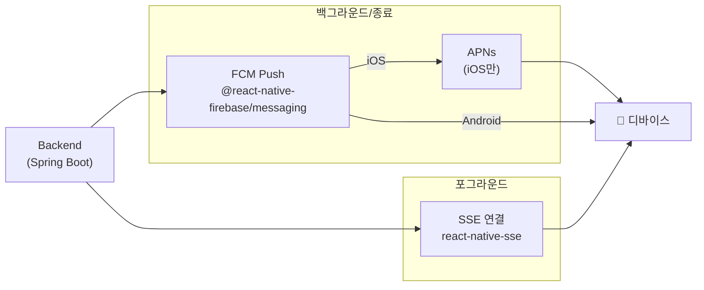
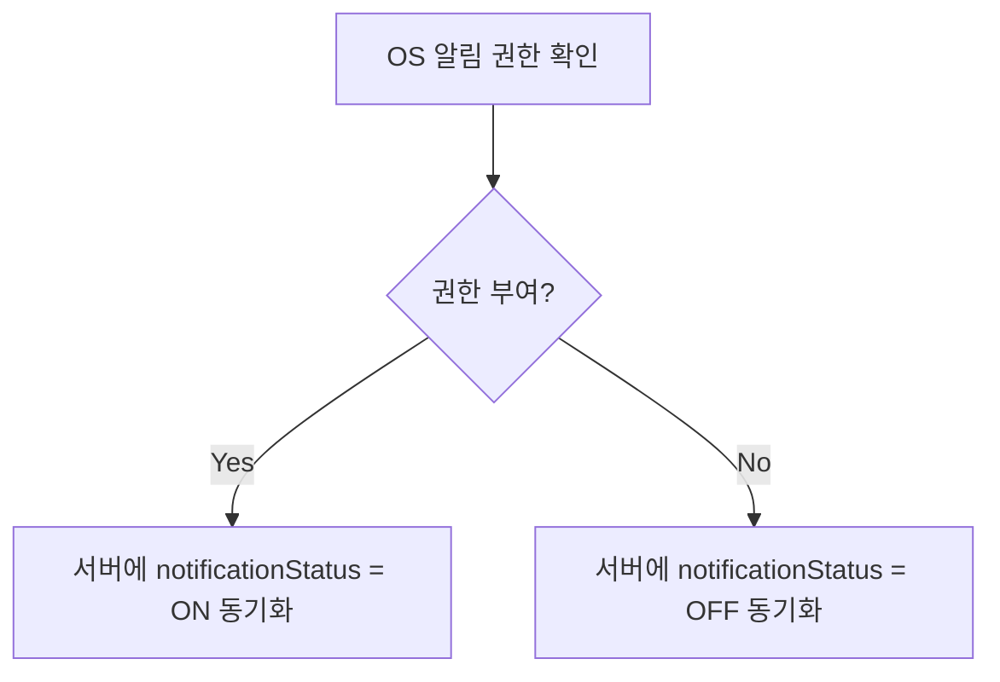

# 알림 시스템

## 개요

앱 상태에 따라 두 채널로 알림을 분리합니다.

| 앱 상태 | 채널 | 라이브러리 |
| --- | --- | --- |
| **포그라운드** | SSE (Server-Sent Events) | `react-native-sse` |
| **백그라운드 / 종료** | FCM Push | `@react-native-firebase/messaging` |

 

## SSE (포그라운드 알림)

앱이 포그라운드에 있을 때 `react-native-sse`로 서버에 연결을 유지하고 실시간 이벤트를 수신합니다.

### 주요 파일

- `hooks/useNotifications.ts` — SSE 연결 관리 및 알림 데이터 처리

### 동작 방식

1. 로그인 후 SSE 연결 수립
2. 서버에서 알림 이벤트 발생 시 실시간 수신
3. `notificationStore`에 상태 반영
4. 앱이 백그라운드로 전환되면 연결 해제

 

## FCM (백그라운드/종료 상태 알림)

앱이 백그라운드이거나 종료된 상태에서는 FCM을 통해 푸시 알림을 수신합니다.

### 주요 파일

- `hooks/usePushNotification.ts` — FCM 토큰 발급, 백그라운드 핸들러 등록

### FCM 토큰 생명주기

FCM 토큰의 등록/해제는 **로그인·로그아웃 생명주기**에 연결합니다. 알림 설정 토글의 역할이 아닙니다.

| 시점 | 동작 | API |
| --- | --- | --- |
| **로그인** | FCM 토큰 발급 + 서버 등록 | `POST /api/notification/token` |
| **로그아웃** | 서버에서 토큰 비활성화 | `PATCH /api/notification/token/deactivate` |

### iOS APNs 제약

iOS에서 FCM은 반드시 APNs(Apple Push Notification service)를 통해 라우팅되며, 우회할 수 없습니다. Firebase Console에 APNs 인증 키(`.p8` 파일)를 등록해야 iOS 푸시가 동작합니다.

 

## 알림 권한

### OS 권한이 Source of Truth

알림 on/off의 최종 권한은 OS 설정입니다. 서버의 `notificationStatus`는 OS 권한 상태를 따릅니다.

### 알림 상태 동기화 지점

서버에 `PATCH /api/user/notification`을 호출하는 3가지 시점:

1. **로그인 시** — OS 권한 확인 후 서버 상태 동기화
2. **로그아웃 시** — 알림 비활성화
3. **설정 토글 변경 시** — 사용자가 앱 내 알림 설정을 변경할 때

### 주요 파일

- `hooks/useNotificationPermission.ts` — OS 알림 권한 요청 및 상태 확인
- `hooks/useTrackingPermission.ts` — iOS ATT 권한 (광고 추적)
- `store/notificationStore.ts` — 알림 상태 전역 관리

 

## 알림 읽음 상태

서버와 읽음 상태(`isRead`)를 동기화합니다. 사용자가 알림을 확인하면 `PATCH /api/user/notification`으로 읽음 처리합니다.
