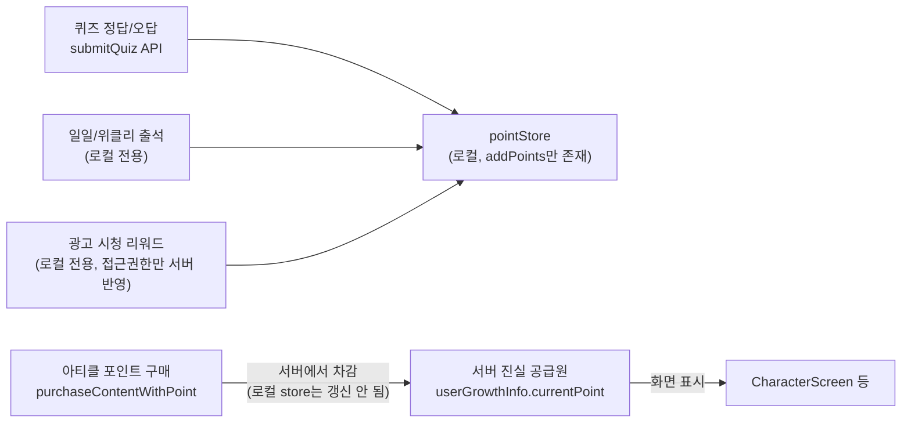
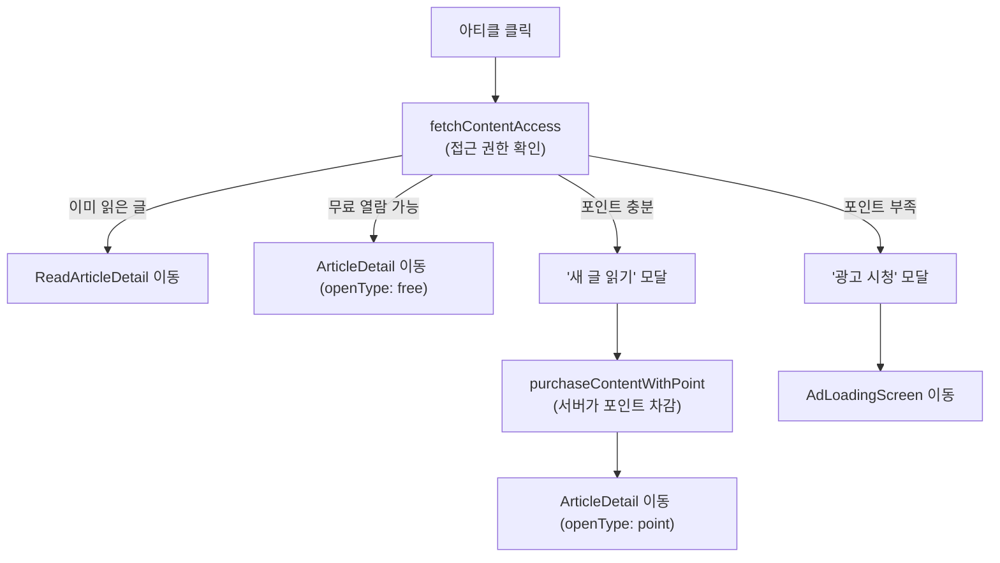

# 포인트 플로우

## 개요

포인트는 퀴즈, 일일/위클리 출석, 광고 시청 세 가지 액션에서 지급되고, 아티클(글) 잠금 해제에 사용(차감)됩니다. **화면에 실제로 보여지는 포인트는 항상 서버 값**이고, `pointStore`(zustand)의 로컬 값은 일부 화면에서만 쓰이는 낙관적 임시 값입니다.

 

## 포인트 지급 소스별 정리

| 소스 | 서버 API 호출 | 로컬 store 반영 | 지급 위치 |
| --- | --- | --- | --- |
| 퀴즈 정답/오답 | ✅ `submitQuiz` (`rewardResponse.earnedPoint`) | `addPoints()` | `QuizScreen` 제출 핸들러 |
| 일일/위클리 출석 | ❌ 없음 (위클리 판정에만 `fetchCharacterMe` 조회) | `addPoints()` | `MissionScreen` Effect 4 |
| 광고 시청 리워드 | ❌ 없음 — 접근 권한 자체는 별도로 `purchaseContentWithAd`가 서버에 반영 | `addPoints(AD_REWARD_POINTS)` | `AdLoadingScreen` Effect 5 |

세 경로 모두 `pointStore.addPoints()`를 호출해 로컬 값을 올리지만, 이 값을 화면에 직접 노출하는 곳은 사실상 없습니다 (아래 "진실 공급원" 참고).

 

## 포인트 사용(차감) 흐름 — 아티클 포인트 구매

`useArticleNavigation` 훅이 아티클 클릭 시 접근 권한을 확인하고 분기합니다.

`purchaseContentWithPoint`/`purchaseContentWithAd`의 응답(`PurchaseContentResponse`)은 `{ status, message, data: string }` 형태로, **차감 후 최신 포인트 값을 내려주지 않습니다.** 그래서 구매에 성공해도 `pointStore`를 갱신할 방법이 마땅치 않고, 실제로 구매 성공 경로 어디에서도 `subtractPoints()`/`setPoints()`를 호출하지 않습니다.

 

## 진실 공급원: 서버 vs 로컬 pointStore

- **화면에 표시되는 포인트**는 전부 서버 값입니다. 예: `CharacterScreen`은 `useCharacterMe()`가 내려주는 `userGrowthInfo.currentPoint`를 직접 사용합니다 (`pointStore`를 참조하지 않음).
- **`pointStore.points`**는 코드 전체에서 `addPoints()`만 호출되고, `setPoints()`(서버 값으로 동기화)와 `subtractPoints()`(차감 반영) 호출부는 한 곳도 없습니다. 즉 앱 실행 중 한 번도 서버 값으로 보정되지 않고, 구매로 차감돼도 반영되지 않는 "한 방향으로만 누적되는" 값입니다.
- 이 값이 실제로 읽히는 유일한 곳은 `useArticleNavigation`의 fallback입니다: `fetchContentAccess` 응답에 `currentPoints`가 없을 때만 `storePoints`(로컬 값)로 대체해서 "포인트가 충분한지" 판단합니다. 평소엔 서버가 내려주는 `currentPoints`를 우선 쓰므로 문제가 드러나지 않지만, 이 fallback이 실제로 타는 상황이라면 구매 이력이 반영 안 된 값이라 실제보다 높게 표시될 수 있습니다. 다만 최종 차감/검증은 서버(`purchaseContentWithPoint`)가 하므로 포인트가 실제로 마이너스가 되는 일은 없습니다 — 오판 위험은 "구매 가능하다고 잘못 보여주는 UI"에 한정됩니다.

**Q. 출석 보상을 서버 API에 연동하면 포인트 불일치가 완전히 사라지나?**
아니요. 화면에 보이는 잔액(`userGrowthInfo.currentPoint`, `fetchContentAccess.currentPoints`)은 이미 매번 서버에서 새로 조회하는 구조라 출석 연동 여부와 무관하게 대부분 안전합니다. 그래도 남는 위험 두 가지:
1. 위에서 설명한 `useArticleNavigation`의 로컬 fallback 경로 — `subtractPoints()`가 전혀 호출되지 않아 차감이 반영 안 된 값으로 폴백될 수 있음.
2. 보상 모달에 보여주는 적립량을 클라이언트 상수(`DAILY_ATTENDANCE_POINT` 등)로 고정할지, 서버 응답값을 그대로 쓸지에 따라 갈림 — 서버가 보너스/캡 등으로 다른 값을 적립했는데 클라이언트가 상수를 쓰면 그 순간 모달에 뜨는 숫자만 실제와 어긋날 수 있음 (지속되는 잔액 불일치는 아님).

 

## 포인트 획득 내역 조회

- `GET /api/characters/history` (`fetchPointHistory`)가 `{ historyId, point, exp, reason, createdAt }` 배열을 최신순으로 반환합니다. `usePointHistory` 훅으로 조회하고 `PointHistoryScreen`에서 목록으로 보여줍니다.
- 이름 그대로 "획득" 내역 API라, 아티클 포인트 구매(차감) 건이 이 목록에 함께 나오는지는 코드만으로는 확인할 수 없습니다 — 실제 서버 데이터로 확인이 필요합니다.
- 보상 지급 시점(`grantArticleReadReward`, `QuizScreen`, `MissionScreen`)마다 `prefetchPointHistoryAfterReward()`로 이 내역을 미리 백그라운드 조회해둬서, 사용자가 "받은 내역 확인하기"로 들어갔을 때 로딩 없이 바로 보이게 합니다.

 

## 보상 기준값 관리

- 지급/차감 기준값(`ARTICLE_READ_POINT_COST`, `QUIZ_CORRECT_POINT`, `DAILY_ATTENDANCE_POINT` 등)은 전부 `src/config/rewards.ts`의 `DEFAULT_REWARDS_CONFIG`에 하드코딩돼 있습니다.
- 파일 상단 주석엔 "서버에서 리워드 설정을 받아오지만, 오프라인/에러 시 기본값으로 사용"이라고 적혀 있지만, 실제로 이 기본값을 덮어쓰는 코드는 없습니다 — 항상 하드코딩된 기본값이 그대로 쓰입니다.
- `useCharacterReward`/`fetchCharacterReward`(캐릭터 리워드 기준 조회 API)가 타입과 함수까지 정의돼 있지만, 어디에서도 호출되지 않는 미사용 코드입니다. 서버 정책이 바뀌면 이 상수들을 코드에서 직접 수정하고 앱을 업데이트해야 반영됩니다.

 

## 알려진 제약 / 위험

- 포인트 차감(구매)이 로컬 `pointStore`에 반영되지 않습니다. `fetchContentAccess`가 `currentPoints`를 내려주지 않는 예외 상황이 생기면, fallback으로 쓰이는 로컬 값이 실제보다 높게 나와 "구매 가능"으로 잘못 표시될 수 있습니다.
- 보상 기준값이 로컬 하드코딩이라 서버 정책 변경이 앱 업데이트 없이 반영되지 않습니다.
- 구매(차감) 내역이 "포인트 획득 내역" API에 어떻게 표시되는지 코드상 불명확합니다.
- [`docs/LEVEL_UP_FLOW.md`](./LEVEL_UP_FLOW.md) 문서와 마찬가지로, 일일/위클리 출석은 서버 API 호출 없이 로컬에서만 포인트를 올리는 구조라 서버와 완전히 독립적입니다.
- (2026-08-30 임시 조치) 출석 보상이 레벨업일 경우 `MissionScreen`이 `fetchCharacterData`로 서버 경험치를 조회해 클라이언트에서 레벨업 여부를 추정합니다 — 포인트 자체의 서버 동기화 방식을 바꾼 건 아니며, 레벨업 모달 표시 여부만 추정합니다. 자세한 내용은 [`docs/LEVEL_UP_FLOW.md`](./LEVEL_UP_FLOW.md)의 "출석 레벨업 임시 조치" 참고.

 

## 주요 파일

- `src/store/pointStore.ts` — 포인트 로컬 상태 (`addPoints`만 실제로 쓰임)
- `src/config/rewards.ts` — 지급/차감 기준값 (`DEFAULT_REWARDS_CONFIG`)
- `src/hooks/useArticleNavigation.ts` — 아티클 접근 권한 확인 및 포인트 구매 플로우
- `src/api/missionApi.ts` — `fetchContentAccess`, `purchaseContentWithPoint`, `purchaseContentWithAd`
- `src/api/pointHistoryApi.ts`, `src/hooks/usePointHistory.ts`, `src/screens/character/history/PointHistoryScreen.tsx` — 포인트/경험치 획득 내역
- `src/screens/common/AdLoadingScreen.tsx` — 광고 시청 포인트 리워드
- `src/screens/common/QuizScreen.tsx`, `src/screens/main/MissionScreen.tsx` — 포인트 지급
- `src/api/characterApi.ts` — `UserGrowthInfo.currentPoint` (서버 진실 공급원)
