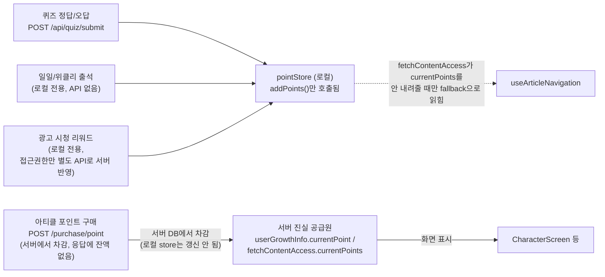
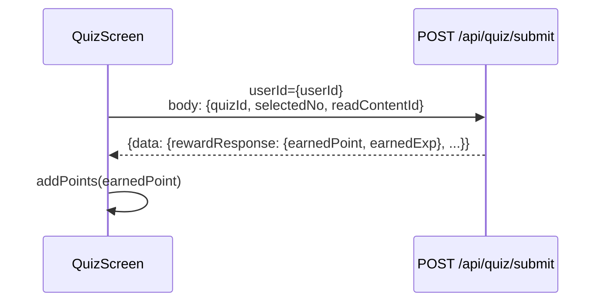
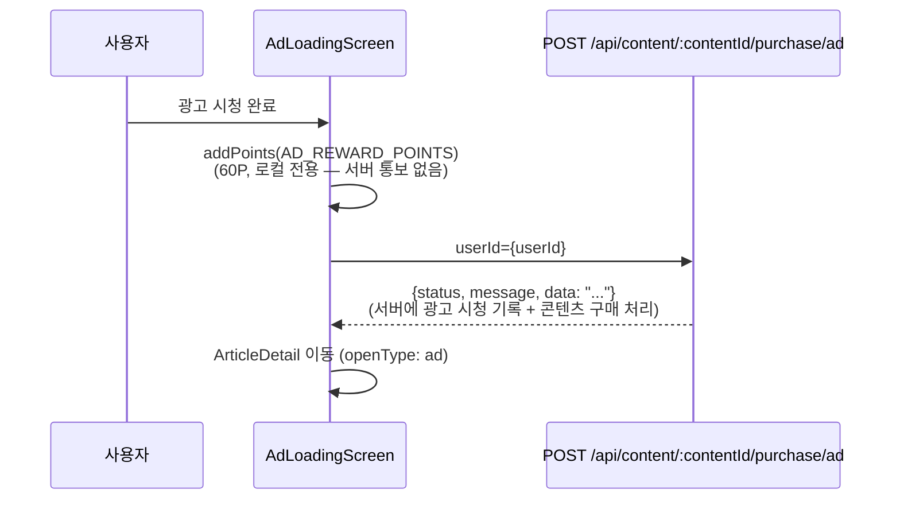
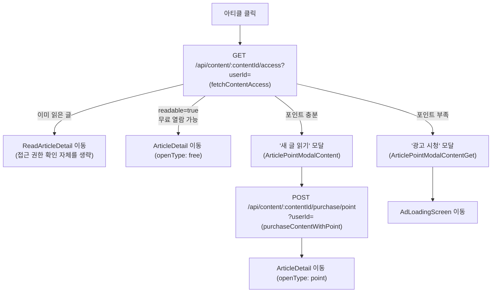

# 포인트 플로우

> 최종 갱신: 2026-08-31. 이 문서는 "지금 코드가 실제로 어떻게 동작하는가"를 최대한 상세히 기록합니다.

## 목차

1. [한눈에 보는 요약](#한눈에-보는-요약)
2. [전체 아키텍처](#전체-아키텍처)
3. [포인트 지급 경로별 상세](#포인트-지급-경로별-상세)
   - [3.1 퀴즈 제출](#31-퀴즈-제출)
   - [3.2 일일·위클리 출석](#32-일일위클리-출석)
   - [3.3 광고 시청 리워드](#33-광고-시청-리워드)
4. [포인트 사용(차감) 흐름 — 아티클 포인트 구매](#포인트-사용차감-흐름--아티클-포인트-구매)
5. [진실 공급원: 서버 vs 로컬 pointStore](#진실-공급원-서버-vs-로컬-pointstore)
6. [현재 구조의 문제점 총정리](#현재-구조의-문제점-총정리)
7. [포인트 획득 내역 조회](#포인트-획득-내역-조회)
8. [보상 기준값 관리](#보상-기준값-관리)
9. [알려진 제약 / 위험](#알려진-제약--위험)
10. [주요 파일](#주요-파일)

 

## 한눈에 보는 요약

- 포인트는 **퀴즈 정답/오답, 일일/위클리 출석, 광고 시청 리워드** 세 경로에서 지급되고, **아티클(글) 잠금 해제**에 사용(차감)됩니다.
- **화면에 실제로 보여지는 포인트는 항상 서버 값**입니다(`userGrowthInfo.currentPoint` 등, 매번 새로 조회). `pointStore`(zustand)의 로컬 값은 `addPoints()`만 호출되고 화면에 직접 노출되는 곳이 사실상 없는, "쌓이기만 하고 거의 읽히지 않는" 값입니다.
- 서버·클라이언트의 권장 개선 계약과 전역 보상 큐 설계는 [`REWARD_SYSTEM_DESIGN.md`](./REWARD_SYSTEM_DESIGN.md)를 참고하세요. 현재 구현은 아직 해당 구조로 서버 동기화된 상태가 아닙니다.
- 지급 3경로 중 **서버 API 응답으로 실제 지급 사실을 확인할 수 있는 건 퀴즈뿐**입니다. 출석과 광고 시청은 지급 자체를 서버에 알리는 API가 없어 클라이언트가 로컬로만 포인트를 올립니다(광고 시청은 콘텐츠 접근 권한만 별도 API로 서버에 반영됨).
- 포인트 **차감**(아티클 구매)은 서버에서 정상적으로 처리되지만, 그 결과(차감 후 잔액)를 응답으로 내려주지 않아서 로컬 `pointStore`에는 전혀 반영되지 않습니다. `subtractPoints()`/`setPoints()`는 코드 전체에서 한 번도 호출되지 않습니다.

 

## 전체 아키텍처

 

## 포인트 지급 경로별 상세

### 3.1 퀴즈 제출

- 엔드포인트: `POST /api/quiz/submit?userId={userId}`, 함수 `submitQuiz`(`src/api/missionApi.ts`).
- 요청 바디: `{ quizId: number, selectedNo: number, readContentId: number }`
- 응답 중 포인트 관련 필드: `data.rewardResponse.earnedPoint: number` — 정답이면 30P, 오답이면 10P가 기본값이지만, **실제 지급되는 값은 이 응답 필드를 그대로 신뢰**하며 클라이언트가 별도로 계산하지 않습니다.
- 유일하게 **서버 API 응답으로 지급 사실이 확인되는 경로**입니다.

### 3.2 일일·위클리 출석

- `MissionScreen`의 Effect 4에서, 포인트를 서버에 알리는 API 없이 `addPoints(totalPoint)`만 호출합니다.
- `totalPoint = DAILY_ATTENDANCE_POINT(10) + (위클리 조건 충족 시 WEEKLY_ATTENDANCE_POINT(30))`.
- 위클리 조건 판정에만 `GET /api/characters/me?userId={userId}`(`fetchCharacterMe`)를 호출해 서버의 `attendance.{monday..saturday}`가 전부 `true`인지 확인합니다. 이 호출은 포인트 지급과 무관하며 순수하게 "이번 주 월~토를 다 채웠는가"만 확인하는 용도입니다.
- 자세한 흐름과 최근 추가된 레벨업 임시 조치(포인트 지급과는 별개)는 [`docs/LEVEL_UP_FLOW.md`](./LEVEL_UP_FLOW.md)의 "일일·위클리 출석" 섹션 참고.

### 3.3 광고 시청 리워드

`AdLoadingScreen`의 Effect 5에서 처리됩니다. **포인트 지급 자체와 "콘텐츠 접근 권한 부여"가 서로 다른 두 단계로 분리**되어 있다는 점이 이 경로의 핵심입니다.

- 포인트(60P, `AD_REWARD_POINTS`) 지급 자체는 로컬 전용 — `addPoints(AD_REWARD_POINTS)`. 서버에 "광고 보상 포인트를 지급했다"고 알리는 API는 없습니다.
- 대신 `purchaseContentWithAd`(`POST /api/content/:contentId/purchase/ad?userId={userId}`)가 **별도로** 호출되어, 서버에 "이 콘텐츠에 대해 광고 시청으로 접근 권한을 얻었다"는 사실을 반영합니다. 이 API는 포인트에 대해서는 아무것도 응답하지 않고(`data: string` 처리 결과 메시지뿐), 콘텐츠 접근 권한만 서버에 기록합니다.
- 즉 "포인트 60점을 얻었다"는 사실과 "이 글을 광고로 열람할 권한을 얻었다"는 사실이 **서로 다른 곳에 따로 기록**됩니다 — 전자는 클라이언트에만, 후자는 서버에만.

 

## 포인트 사용(차감) 흐름 — 아티클 포인트 구매

`useArticleNavigation` 훅이 아티클 클릭 시 접근 권한을 확인하고 분기합니다.

**요청/응답 상세**:

- 접근 확인: `GET /api/content/:contentId/access?userId={userId}` (`fetchContentAccess`). 응답(`ContentAccessResponse`): `{ accessType: string, title: string, message: string, currentPoints: number, requiredPoints: number, lackOfPoints: number, rewardPoints: number, readable: boolean }`.
  - `readable`이 분기의 기준. `currentPoints`(서버가 아는 현재 포인트)와 `requiredPoints`(이 글을 읽는 데 필요한 포인트, `ARTICLE_READ_POINT_COST`=30과 대응)를 비교해 포인트 충분/부족 모달을 고름.
- 구매: `POST /api/content/:contentId/purchase/point?userId={userId}` (`purchaseContentWithPoint`). 요청 바디 없음(쿼리스트링만). 응답(`PurchaseContentResponse`): `{ status: number, message: string, data: string }`.
  - **`data`가 단순 처리 결과 문자열이라, 차감 후 최신 포인트 값을 응답으로 내려주지 않습니다.** 그래서 구매에 성공해도 클라이언트가 `pointStore`를 정확한 값으로 갱신할 방법이 마땅치 않고, 실제로 구매 성공 경로 어디에서도 `subtractPoints()`/`setPoints()`를 호출하지 않습니다 — 서버 DB에서는 정상적으로 차감되지만, 로컬 `pointStore.points`는 그 사실을 전혀 모르는 채로 남습니다.

 

## 진실 공급원: 서버 vs 로컬 pointStore

- **화면에 표시되는 포인트**는 전부 서버 값입니다. 예: `CharacterScreen`은 `useCharacterMe()`가 내려주는 `userGrowthInfo.currentPoint`를 직접 사용합니다 (`pointStore`를 참조하지 않음).
- **`pointStore.points`**는 코드 전체에서 `addPoints()`만 호출되고, `setPoints()`(서버 값으로 동기화)와 `subtractPoints()`(차감 반영) 호출부는 한 곳도 없습니다. 즉 앱 실행 중 한 번도 서버 값으로 보정되지 않고, 구매로 차감돼도 반영되지 않는 "한 방향으로만 누적되는" 값입니다.
- 이 값이 실제로 읽히는 유일한 곳은 `useArticleNavigation`의 fallback입니다: `fetchContentAccess` 응답에 `currentPoints`가 없을 때만 `storePoints`(로컬 값)로 대체해서 "포인트가 충분한지" 판단합니다(`src/hooks/useArticleNavigation.ts` 146번째 줄 부근, `accessData.currentPoints !== undefined ? accessData.currentPoints : storePoints`). 평소엔 서버가 내려주는 `currentPoints`를 우선 쓰므로 문제가 드러나지 않지만, 이 fallback이 실제로 타는 상황이라면 구매 이력이 반영 안 된 값이라 실제보다 높게 표시될 수 있습니다. 다만 최종 차감/검증은 서버(`purchaseContentWithPoint`)가 하므로 포인트가 실제로 마이너스가 되는 일은 없습니다 — 오판 위험은 "구매 가능하다고 잘못 보여주는 UI"에 한정됩니다.

**Q. 출석 보상을 서버 API에 연동하면 포인트 불일치가 완전히 사라지나?**
아니요. 화면에 보이는 잔액(`userGrowthInfo.currentPoint`, `fetchContentAccess.currentPoints`)은 이미 매번 서버에서 새로 조회하는 구조라 출석 연동 여부와 무관하게 대부분 안전합니다. 그래도 남는 위험 두 가지:

1. 위에서 설명한 `useArticleNavigation`의 로컬 fallback 경로 — `subtractPoints()`가 전혀 호출되지 않아 차감이 반영 안 된 값으로 폴백될 수 있음.
2. 보상 모달에 보여주는 적립량을 클라이언트 상수(`DAILY_ATTENDANCE_POINT` 등)로 고정할지, 서버 응답값을 그대로 쓸지에 따라 갈림 — 서버가 보너스/캡 등으로 다른 값을 적립했는데 클라이언트가 상수를 쓰면 그 순간 모달에 뜨는 숫자만 실제와 어긋날 수 있음 (지속되는 잔액 불일치는 아님).

 

## 현재 구조의 문제점 총정리

1. **포인트 차감이 로컬에 반영되지 않음**: `purchaseContentWithPoint`/`purchaseContentWithAd` 응답이 차감 후 잔액을 내려주지 않아, `pointStore`가 영구히 "차감 전" 값으로 남을 수 있는 구조입니다. 화면 표시는 서버 재조회로 안전하지만, `useArticleNavigation`의 fallback 판단에는 이 문제가 그대로 노출됩니다.
2. **출석·광고 포인트 지급이 서버에 통보되지 않음**: 퀴즈만 서버 API 응답으로 지급이 확인되고, 출석·광고는 클라이언트가 로컬로만 올립니다. 서버의 진짜 `currentPoint`는 퀴즈로만 늘어나며, 출석/광고로 늘어난 로컬 값은 서버와 별개로 존재합니다.
3. **광고 시청 포인트와 콘텐츠 접근 권한이 분리 기록됨**: "포인트를 얻었다"(클라이언트에만 존재)와 "이 글에 접근 권한이 생겼다"(서버에 기록)가 서로 다른 곳에 남아, 두 사실을 하나로 묶어 검증할 방법이 없습니다.
4. **보상 기준값이 전부 로컬 하드코딩**: 서버 정책이 바뀌어도 앱을 업데이트하지 않으면 반영되지 않습니다(아래 "보상 기준값 관리" 참고).
5. **획득 내역 API에 차감(구매) 이력이 포함되는지 불명확**: "포인트 획득 내역"이라는 이름의 API가 아티클 구매(차감) 건도 함께 보여주는지 코드만으로는 판단할 수 없습니다.

 

## 포인트 획득 내역 조회

- 엔드포인트: `GET /api/characters/history?userId={userId}` (`fetchPointHistory`, `src/api/pointHistoryApi.ts`).
- 응답(`PointHistoryApiResponse`): `{ status: number, message: string, data: [{ historyId: number, point: number, exp: number, reason: string, createdAt: string(ISO 8601) }] }` — 최신순 배열.
- `usePointHistory` 훅으로 조회하고 `PointHistoryScreen`에서 목록으로 보여줍니다.
- 이름 그대로 "획득" 내역 API라, 아티클 포인트 구매(차감) 건이 이 목록에 함께 나오는지는 코드만으로는 확인할 수 없습니다 — 실제 서버 데이터로 확인이 필요합니다.
- 보상 지급 시점(`grantArticleReadReward`, `QuizScreen`, `MissionScreen`)마다 `prefetchPointHistoryAfterReward()`로 이 내역을 미리 백그라운드 조회해둬서, 사용자가 "받은 내역 확인하기"로 들어갔을 때 로딩 없이 바로 보이게 합니다.

 

## 보상 기준값 관리

- 지급/차감 기준값은 전부 `src/config/rewards.ts`의 `DEFAULT_REWARDS_CONFIG`에 하드코딩돼 있습니다:

| 상수                         | 값  | 의미                                                  |
| ---------------------------- | --- | ----------------------------------------------------- |
| `articleReadPointCost`       | 30  | 글 읽기에 필요한 포인트(구매 비용)                    |
| `articleReadExperience`      | 5   | 글 읽기 완료 시 지급 경험치                           |
| `adRewardPoints`             | 60  | 광고 시청 완료 시 지급 포인트                         |
| `quizCorrectExperience`      | 25  | 퀴즈 정답 시 경험치(단, 실제 지급값은 서버 응답 우선) |
| `quizCorrectPoint`           | 30  | 퀴즈 정답 시 포인트(위와 동일)                        |
| `quizIncorrectExperience`    | 15  | 퀴즈 오답 시 경험치                                   |
| `quizIncorrectPoint`         | 10  | 퀴즈 오답 시 포인트                                   |
| `dailyAttendanceExperience`  | 5   | 일일 출석 경험치                                      |
| `dailyAttendancePoint`       | 10  | 일일 출석 포인트                                      |
| `weeklyAttendanceExperience` | 30  | 위클리 출석(월~토 완주 시) 추가 경험치                |
| `weeklyAttendancePoint`      | 30  | 위클리 출석 추가 포인트                               |

- 파일 상단 주석엔 "서버에서 리워드 설정을 받아오지만, 오프라인/에러 시 기본값으로 사용"이라고 적혀 있지만, **실제로 이 기본값을 덮어쓰는 코드는 없습니다** — 항상 하드코딩된 기본값이 그대로 쓰입니다.
- `fetchCharacterReward`(`GET /api/characters/standards/reward`, 캐릭터 리워드 기준 조회 API)가 타입과 함수까지 정의돼 있지만, **어디에서도 호출되지 않는 미사용 코드**입니다. 응답 형태는 `{ aboutPointExpInformation: { rewardType, description }, rewardDataResponse: { rewardItem, exp, point } }`. 서버 정책이 바뀌면 이 상수들을 코드에서 직접 수정하고 앱을 업데이트해야 반영됩니다.

 

## 알려진 제약 / 위험

- 포인트 차감(구매)이 로컬 `pointStore`에 반영되지 않습니다. `fetchContentAccess`가 `currentPoints`를 내려주지 않는 예외 상황이 생기면, fallback으로 쓰이는 로컬 값이 실제보다 높게 나와 "구매 가능"으로 잘못 표시될 수 있습니다.
- 보상 기준값이 로컬 하드코딩이라 서버 정책 변경이 앱 업데이트 없이 반영되지 않습니다.
- 구매(차감) 내역이 "포인트 획득 내역" API에 어떻게 표시되는지 코드상 불명확합니다.
- [`docs/LEVEL_UP_FLOW.md`](./LEVEL_UP_FLOW.md) 문서와 마찬가지로, 일일/위클리 출석은 서버 API 호출 없이 로컬에서만 포인트를 올리는 구조라 서버와 완전히 독립적입니다.
- 광고 시청 포인트(60P)와 콘텐츠 접근 권한(`purchaseContentWithAd`)이 서로 다른 곳에 분리 기록되어, 하나가 실패해도 다른 하나는 그대로 유지될 수 있습니다(예: 포인트는 로컬에 반영됐는데 `purchaseContentWithAd` API 호출이 실패하는 경우 등 — 코드상 두 처리 사이에 트랜잭션 보장이 없음).
- (2026-08-30 임시 조치) 출석 보상이 레벨업일 경우 `MissionScreen`이 `fetchCharacterData`로 서버 경험치를 조회해 클라이언트에서 레벨업 여부를 추정합니다 — 포인트 자체의 서버 동기화 방식을 바꾼 건 아니며, 레벨업 모달 표시 여부만 추정합니다. 자세한 내용은 [`docs/LEVEL_UP_FLOW.md`](./LEVEL_UP_FLOW.md)의 "일일·위클리 출석" 참고.

 

## 주요 파일

- `src/store/pointStore.ts` — 포인트 로컬 상태 (`addPoints`만 실제로 쓰임)
- `src/config/rewards.ts` — 지급/차감 기준값 (`DEFAULT_REWARDS_CONFIG`)
- `src/hooks/useArticleNavigation.ts` — 아티클 접근 권한 확인 및 포인트 구매 플로우
- `src/api/missionApi.ts` — `fetchContentAccess`, `purchaseContentWithPoint`, `purchaseContentWithAd`
- `src/api/pointHistoryApi.ts`, `src/hooks/usePointHistory.ts`, `src/screens/character/history/PointHistoryScreen.tsx` — 포인트/경험치 획득 내역
- `src/screens/common/AdLoadingScreen.tsx` — 광고 시청 포인트 리워드 + `purchaseContentWithAd`
- `src/screens/common/QuizScreen.tsx`, `src/screens/main/MissionScreen.tsx` — 포인트 지급
- `src/api/characterApi.ts` — `UserGrowthInfo.currentPoint` (서버 진실 공급원)
