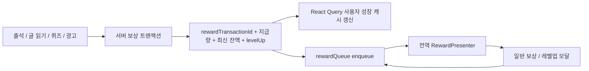

# 보상·레벨업 시스템 재설계안

> 작성: 2026-08-31. 현재 UI 통합 이후 서버와 클라이언트가 함께 적용할 2단계 목표 구조입니다.

## 결론

포인트·경험치·레벨은 서버를 단일 진실 공급원으로 두고, 클라이언트는 서버가 확정한 **보상 거래(reward transaction)** 를 전역 큐에 넣어 순서대로 표시해야 합니다. 화면은 보상 수치나 레벨업 여부를 계산하지 않고 액션만 요청합니다.



## 서버팀에 전달할 핵심 요청

서버팀에는 아래 네 가지를 우선 요청하면 됩니다.

1. 출석과 글 읽기 보상을 서버에서 실제 지급하고 레벨업까지 판정해주세요.
2. 출석·글 읽기·퀴즈·광고 보상 응답에 `이번 지급량`, `지급 후 최신 포인트·경험치·레벨`, `레벨업 정보`를 같은 형식으로 내려주세요.
3. 포인트 구매 응답에 차감 후 최신 포인트를 내려주세요.
4. 재시도나 중복 요청에도 한 번만 처리되도록 요청 ID 기반 멱등성을 보장하고 `rewardTransactionId`를 내려주세요.

### 서버팀 전달용 문구

> 현재 프론트에는 버튼 연타와 화면 재진입을 막는 중복 방지가 일부 구현되어 있지만, 기기 변경·앱 재설치·네트워크 재시도까지 보장하는 서버 멱등성은 확인할 수 없습니다. 또한 주요 화면은 이미 서버 포인트 잔액을 사용하지만, 출석·글 읽기·광고 보상은 로컬 store에서만 증가하고 포인트 구매 응답에는 차감 후 잔액이 없습니다.
>
> 출석 체크와 글 읽기 완료 시 서버에서 보상 지급과 레벨업 판정까지 처리해주세요. 출석·글 읽기·퀴즈·광고 응답에는 보상 거래 ID, 실제 지급 포인트·경험치, 지급 후 최신 잔액·레벨, 레벨업 정보를 공통 형식으로 내려주세요. 포인트 구매 응답에도 차감 후 최신 포인트를 포함해주세요. 네트워크 재시도나 동일 요청 중복 전송 시에는 요청 ID 또는 `Idempotency-Key`를 기준으로 한 번만 지급되도록 처리해주세요.

## 현재 구현 재검토

### 중복 지급 방지는 일부 구현되어 있음

| 경로             | 현재 방어                                          | 보장 범위와 한계                                                                                                  |
| ---------------- | -------------------------------------------------- | ----------------------------------------------------------------------------------------------------------------- |
| 글 읽기          | `@article_read_reward_{articleId}` AsyncStorage 키 | 같은 기기에서는 글당 1회 방어. 앱 데이터 삭제·재설치·다른 기기에는 공유되지 않고 서버 지급 기록도 아님            |
| 일일·위클리 출석 | `@daily_mission_entry` 날짜 키와 화면 ref          | 같은 기기에서 하루 1회 방어. 서버 출석 기록과 별개이며 다른 기기에는 공유되지 않음                                |
| 퀴즈 제출        | `isSubmittingQuizRef`                              | 현재 화면에서 버튼 연타 방어. 타임아웃 후 재시도·화면 재진입·서버 중복 지급 여부는 보장하지 못함                  |
| 포인트 구매      | `isProcessingRef`                                  | 현재 화면에서 구매 버튼 연타 방어. 서버가 동일 콘텐츠 중복 구매를 어떻게 처리하는지는 클라이언트 코드로 확인 불가 |
| 광고             | `hasAddedPointsRef`, `hasPurchasedRef`             | 현재 광고 화면 인스턴스에서 중복 실행 방어. 화면 재생성·다른 기기·서버 거래 중복까지 보장하지 않음                |

따라서 **중복 방지가 전혀 없는 것은 아닙니다.** 현재 코드는 사용자 연타와 동일 화면의 Effect 재실행은 상당 부분 막고 있습니다. 추가로 필요한 것은 장애·재시도·다른 기기까지 포괄하는 서버 측 멱등성입니다. 백엔드의 unique constraint나 기존 지급 이력 검사는 이 클라이언트 저장소만으로 확인할 수 없으므로 서버팀에 실제 구현 여부를 확인해야 합니다.

출석은 날짜 키를 보상 계산보다 먼저 저장합니다. 이후 처리에서 실패하면 같은 날 다시 실행되지 않아 중복보다는 **보상 누락** 가능성이 있다는 점도 함께 확인해야 합니다.

### 포인트 잔액도 주요 화면에서는 이미 서버 값을 사용함

- 캐릭터 화면은 `GET /api/characters/me`의 `userGrowthInfo.currentPoint`를 표시합니다.
- 콘텐츠 접근 판단은 `GET /api/content/{id}/access`의 `currentPoints`를 우선 사용합니다.
- 포인트 구매와 최종 포인트 부족 검증은 서버가 처리합니다.

따라서 화면의 포인트 잔액이 전부 로컬 `pointStore`에 의존하는 구조는 아닙니다. **사용자에게 보이는 주요 잔액은 이미 서버 값이 기준**입니다.

남아 있는 문제는 다음과 같습니다.

- `pointStore`는 `addPoints()`만 호출되고 서버값을 넣는 `setPoints()`나 구매 차감을 반영하는 `subtractPoints()`는 사용되지 않습니다.
- 접근 API에 `currentPoints`가 없을 경우 로컬 store로 fallback하는 코드가 있어, 예외 응답에서는 오래된 값을 사용할 수 있습니다.
- 포인트 구매 응답은 현재 `{ status, message, data: string }`이라 차감 후 잔액을 즉시 캐시에 반영할 수 없습니다.
- 출석·광고 포인트는 로컬에서만 증가하므로 서버 `currentPoint`에는 반영되지 않습니다.

즉 서버팀에는 “포인트 잔액 기능을 새로 만들어달라”가 아니라, **이미 존재하는 서버 잔액을 모든 지급·차감 응답에도 포함해 즉시 동기화할 수 있게 해달라**고 요청하는 것이 정확합니다.

## 서버에서 바꿔야 할 부분

### 1. 모든 지급을 서버 트랜잭션으로 처리

- 출석: 서버가 출석 판정과 일일·위클리 보상 지급을 한 트랜잭션에서 처리합니다.
- 글 읽기: `complete` 요청으로 최초 완독 여부와 보상 지급을 함께 처리합니다.
- 퀴즈: 기존 제출 응답에 최신 잔액과 보상 거래 ID를 추가합니다.
- 광고: 광고 열람권 부여와 보상 지급을 하나의 트랜잭션으로 묶습니다.
- 포인트 구매: 차감 후 최신 잔액을 반드시 응답합니다.

클라이언트 상수는 표시용 fallback으로도 사용하지 않고, 실제 지급량은 서버 응답만 사용합니다.

### 2. 공통 응답 계약

```ts
interface RewardTransactionResponse {
  rewardTransactionId: string;
  source:
    | 'DAILY_ATTENDANCE'
    | 'WEEKLY_ATTENDANCE'
    | 'ARTICLE_READ'
    | 'QUIZ'
    | 'AD';
  subjectId?: string;
  rewards: {
    point: number;
    exp: number;
    breakdown: Array<{
      reason: string;
      point: number;
      exp: number;
    }>;
  };
  balance: {
    currentPoint: number;
    currentExp: number;
    levelCode: string;
  };
  levelUp?: {
    previousLevelCode: string;
    currentLevelCode: string;
    characterName: string;
    characterImageUrl: string;
    title: string;
    message: string;
  };
}
```

`rewardTransactionId`는 재시도·중복 탭·화면 재진입에도 같은 보상이 두 번 지급되거나 두 번 노출되지 않도록 하는 멱등 키입니다. 지급 요청에도 `Idempotency-Key` 또는 동일 역할의 `requestId`가 필요합니다.

### 3. 권장 엔드포인트

| 상황        | 권장 변경                                                                         |
| ----------- | --------------------------------------------------------------------------------- |
| 출석        | `POST /api/attendance/check-in`에서 출석 판정, 데일리·위클리 지급, 공통 응답 반환 |
| 글 읽기     | `POST /api/content/{id}/complete`에서 최초 완독과 보상 지급, 공통 응답 반환       |
| 퀴즈        | 기존 `POST /api/quiz/submit` 응답에 거래 ID·최신 잔액·레벨업 정보 포함            |
| 광고        | 기존 광고 구매 API가 접근권한과 보상을 원자적으로 처리하고 공통 응답 반환         |
| 포인트 구매 | 구매 성공 응답에 `currentPoint`와 거래 ID 포함                                    |
| 미수신 보상 | 필요하면 `GET /api/rewards/pending`과 `POST /api/rewards/{id}/ack` 제공           |

`pending/ack`는 앱이 서버 응답 직후 종료된 경우에도 다음 실행에서 보상 모달을 다시 전달하기 위한 선택 사항입니다.

## 클라이언트에서 바꿔야 할 부분

### 1. `pointStore`와 `experienceStore`

현재처럼 `addPoints`와 `addExperience`로 로컬 합계를 독립 누적하지 않습니다.

- 최신 잔액은 React Query의 사용자 성장 정보 캐시가 소유합니다.
- mutation 성공 시 서버의 `balance`로 캐시를 **대입**합니다.
- 즉시 반응이 필요하면 optimistic update를 쓸 수 있지만, 실패 rollback과 성공 시 서버값 재대입이 필수입니다.
- Zustand가 필요하다면 잔액이 아니라 아직 표시하지 않은 보상 거래만 보관합니다.

### 2. `levelUpStore`

별도 `pendingLevelUp` store를 제거하고 `RewardEvent.levelUp`에 포함합니다. 레벨업은 보상 거래의 결과이지 독립 상태가 아니므로 거래와 분리하면 다른 보상과 섞이거나 재노출될 수 있습니다.

### 3. 전역 모달과 보상 큐

현재 `modalStore`는 `ReactNode`와 화면 콜백을 저장하므로 데이터가 직렬화되지 않고, 새 모달이 기존 모달을 덮어씁니다. 다음처럼 역할을 분리합니다.

```ts
interface RewardEvent {
  id: string;
  source: RewardSource;
  point: number;
  exp: number;
  breakdown: RewardBreakdown[];
  levelUp?: LevelUpResult;
  context: {
    articleId?: number;
    returnTo?: 'mission' | 'search';
  };
}

interface RewardQueueState {
  current: RewardEvent | null;
  queue: RewardEvent[];
  enqueue: (event: RewardEvent) => void;
  completeCurrent: () => void;
}
```

- API 계층 또는 mutation 훅이 `RewardEvent`를 생성해 큐에 넣습니다.
- 루트의 `RewardPresenter` 한 곳이 `source`, `levelUp`, `context`를 UI와 버튼 intent로 변환합니다.
- `RewardModal`은 순수 표시 컴포넌트로 유지합니다.
- 버튼은 임의 함수 대신 `NEXT_ARTICLE`, `START_QUIZ`, `DISMISS` 같은 intent로 표현하면 테스트와 복구가 쉬워집니다.
- 동일 `id`가 큐나 완료 목록에 있으면 중복 enqueue하지 않습니다.
- 일반 알림·바텀시트·토스트용 `modalStore`와 보상 큐는 분리합니다.

## 적용 순서

1. 서버 공통 보상 응답과 멱등성부터 추가합니다.
2. 클라이언트에 `rewardQueueStore`와 `RewardPresenter`를 추가합니다.
3. 퀴즈부터 서버 응답 → 캐시 대입 → 큐 enqueue로 전환합니다.
4. 출석·글 읽기·광고를 서버 지급 API로 옮깁니다.
5. 모든 경로 전환 후 로컬 `addPoints`/`addExperience`, 레벨업 추정, `levelUpStore`를 제거합니다.
6. 포인트 구매 응답으로 잔액 캐시를 갱신하고 로컬 fallback을 제거합니다.

## 이번 클라이언트 작업과의 경계

이번 변경은 확정된 시안에 맞춰 공용 `RewardModal`의 `compact`/`split` 레이아웃과 상황별 액션을 통일합니다. 서버 지급 API가 아직 없으므로 기존 로컬 누적과 출석·글 읽기 레벨업 추정은 동작 보존을 위해 유지합니다. 위 재설계가 적용되기 전에는 이를 서버 동기화 완료로 간주하면 안 됩니다.
