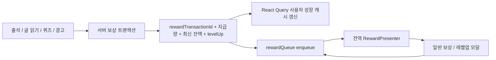

# 보상·레벨업 시스템 재설계안

> 작성: 2026-08-31. 현재 UI 통합 이후 서버와 클라이언트가 함께 적용할 2단계 목표 구조입니다.

## 결론

포인트·경험치·레벨은 서버를 단일 진실 공급원으로 두고, 클라이언트는 서버가 확정한 **보상 거래(reward transaction)** 를 전역 큐에 넣어 순서대로 표시해야 합니다. 화면은 보상 수치나 레벨업 여부를 계산하지 않고 액션만 요청합니다.



## 서버에서 바꿔야 할 부분

### 1. 모든 지급을 서버 트랜잭션으로 처리

- 출석: 서버가 출석 판정과 일일·위클리 보상 지급을 한 트랜잭션에서 처리합니다.
- 글 읽기: `complete` 요청으로 최초 완독 여부와 보상 지급을 함께 처리합니다.
- 퀴즈: 기존 제출 응답에 최신 잔액과 보상 거래 ID를 추가합니다.
- 광고: 광고 열람권 부여와 보상 지급을 하나의 트랜잭션으로 묶습니다.
- 포인트 구매: 차감 후 최신 잔액을 반드시 응답합니다.

클라이언트 상수는 표시용 fallback으로도 사용하지 않고, 실제 지급량은 서버 응답만 사용합니다.

### 2. 공통 응답 계약

```ts
interface RewardTransactionResponse {
  rewardTransactionId: string;
  source:
    | 'DAILY_ATTENDANCE'
    | 'WEEKLY_ATTENDANCE'
    | 'ARTICLE_READ'
    | 'QUIZ'
    | 'AD';
  subjectId?: string;
  rewards: {
    point: number;
    exp: number;
    breakdown: Array<{
      reason: string;
      point: number;
      exp: number;
    }>;
  };
  balance: {
    currentPoint: number;
    currentExp: number;
    levelCode: string;
  };
  levelUp?: {
    previousLevelCode: string;
    currentLevelCode: string;
    characterName: string;
    characterImageUrl: string;
    title: string;
    message: string;
  };
}
```

`rewardTransactionId`는 재시도·중복 탭·화면 재진입에도 같은 보상이 두 번 지급되거나 두 번 노출되지 않도록 하는 멱등 키입니다. 지급 요청에도 `Idempotency-Key` 또는 동일 역할의 `requestId`가 필요합니다.

### 3. 권장 엔드포인트

| 상황        | 권장 변경                                                                         |
| ----------- | --------------------------------------------------------------------------------- |
| 출석        | `POST /api/attendance/check-in`에서 출석 판정, 데일리·위클리 지급, 공통 응답 반환 |
| 글 읽기     | `POST /api/content/{id}/complete`에서 최초 완독과 보상 지급, 공통 응답 반환       |
| 퀴즈        | 기존 `POST /api/quiz/submit` 응답에 거래 ID·최신 잔액·레벨업 정보 포함            |
| 광고        | 기존 광고 구매 API가 접근권한과 보상을 원자적으로 처리하고 공통 응답 반환         |
| 포인트 구매 | 구매 성공 응답에 `currentPoint`와 거래 ID 포함                                    |
| 미수신 보상 | 필요하면 `GET /api/rewards/pending`과 `POST /api/rewards/{id}/ack` 제공           |

`pending/ack`는 앱이 서버 응답 직후 종료된 경우에도 다음 실행에서 보상 모달을 다시 전달하기 위한 선택 사항입니다.

## 클라이언트에서 바꿔야 할 부분

### 1. `pointStore`와 `experienceStore`

현재처럼 `addPoints`와 `addExperience`로 로컬 합계를 독립 누적하지 않습니다.

- 최신 잔액은 React Query의 사용자 성장 정보 캐시가 소유합니다.
- mutation 성공 시 서버의 `balance`로 캐시를 **대입**합니다.
- 즉시 반응이 필요하면 optimistic update를 쓸 수 있지만, 실패 rollback과 성공 시 서버값 재대입이 필수입니다.
- Zustand가 필요하다면 잔액이 아니라 아직 표시하지 않은 보상 거래만 보관합니다.

### 2. `levelUpStore`

별도 `pendingLevelUp` store를 제거하고 `RewardEvent.levelUp`에 포함합니다. 레벨업은 보상 거래의 결과이지 독립 상태가 아니므로 거래와 분리하면 다른 보상과 섞이거나 재노출될 수 있습니다.

### 3. 전역 모달과 보상 큐

현재 `modalStore`는 `ReactNode`와 화면 콜백을 저장하므로 데이터가 직렬화되지 않고, 새 모달이 기존 모달을 덮어씁니다. 다음처럼 역할을 분리합니다.

```ts
interface RewardEvent {
  id: string;
  source: RewardSource;
  point: number;
  exp: number;
  breakdown: RewardBreakdown[];
  levelUp?: LevelUpResult;
  context: {
    articleId?: number;
    returnTo?: 'mission' | 'search';
  };
}

interface RewardQueueState {
  current: RewardEvent | null;
  queue: RewardEvent[];
  enqueue: (event: RewardEvent) => void;
  completeCurrent: () => void;
}
```

- API 계층 또는 mutation 훅이 `RewardEvent`를 생성해 큐에 넣습니다.
- 루트의 `RewardPresenter` 한 곳이 `source`, `levelUp`, `context`를 UI와 버튼 intent로 변환합니다.
- `RewardModal`은 순수 표시 컴포넌트로 유지합니다.
- 버튼은 임의 함수 대신 `NEXT_ARTICLE`, `START_QUIZ`, `DISMISS` 같은 intent로 표현하면 테스트와 복구가 쉬워집니다.
- 동일 `id`가 큐나 완료 목록에 있으면 중복 enqueue하지 않습니다.
- 일반 알림·바텀시트·토스트용 `modalStore`와 보상 큐는 분리합니다.

## 적용 순서

1. 서버 공통 보상 응답과 멱등성부터 추가합니다.
2. 클라이언트에 `rewardQueueStore`와 `RewardPresenter`를 추가합니다.
3. 퀴즈부터 서버 응답 → 캐시 대입 → 큐 enqueue로 전환합니다.
4. 출석·글 읽기·광고를 서버 지급 API로 옮깁니다.
5. 모든 경로 전환 후 로컬 `addPoints`/`addExperience`, 레벨업 추정, `levelUpStore`를 제거합니다.
6. 포인트 구매 응답으로 잔액 캐시를 갱신하고 로컬 fallback을 제거합니다.

## 이번 클라이언트 작업과의 경계

이번 변경은 확정된 시안에 맞춰 공용 `RewardModal`의 `compact`/`split` 레이아웃과 상황별 액션을 통일합니다. 서버 지급 API가 아직 없으므로 기존 로컬 누적과 출석·글 읽기 레벨업 추정은 동작 보존을 위해 유지합니다. 위 재설계가 적용되기 전에는 이를 서버 동기화 완료로 간주하면 안 됩니다.
